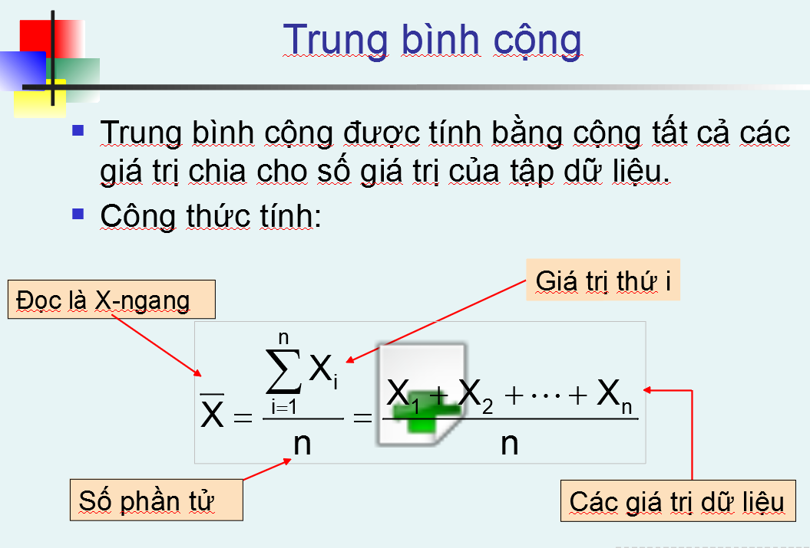
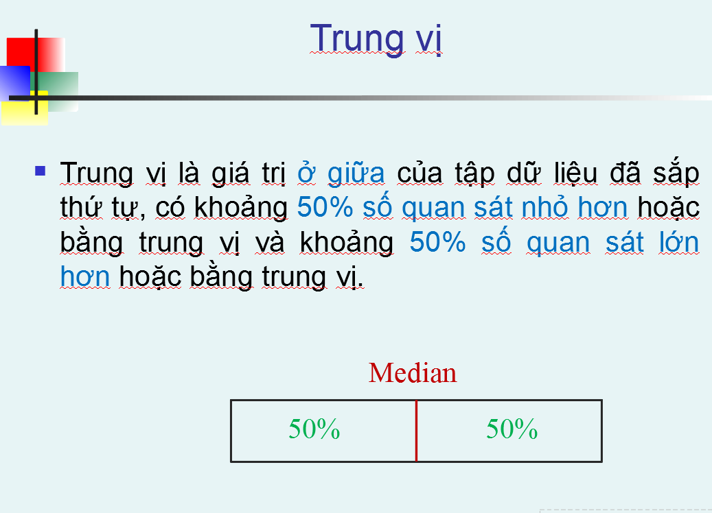
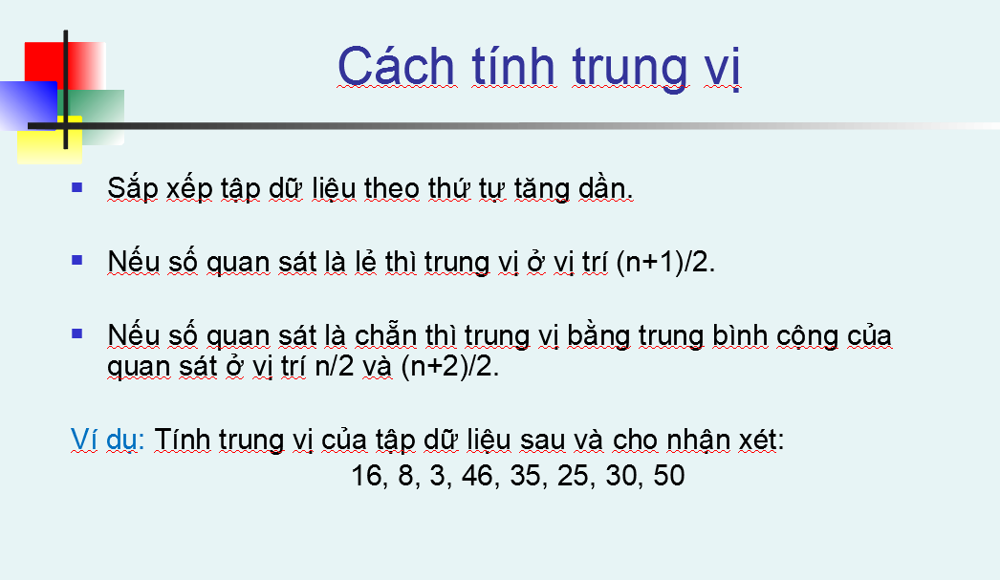
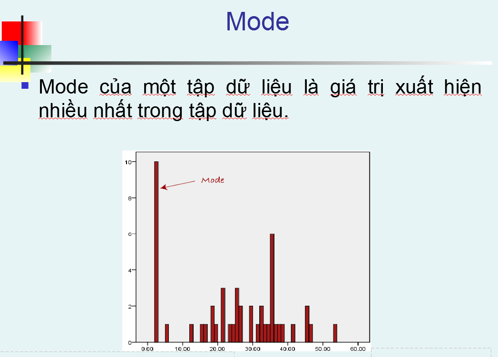
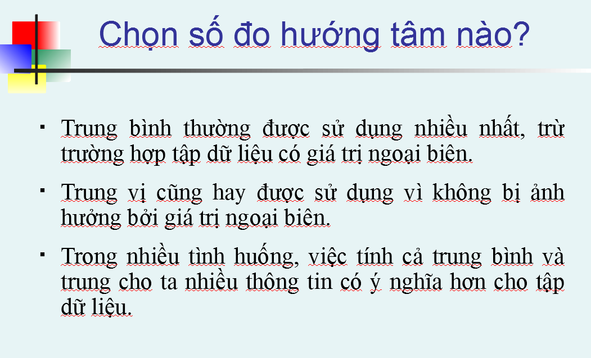
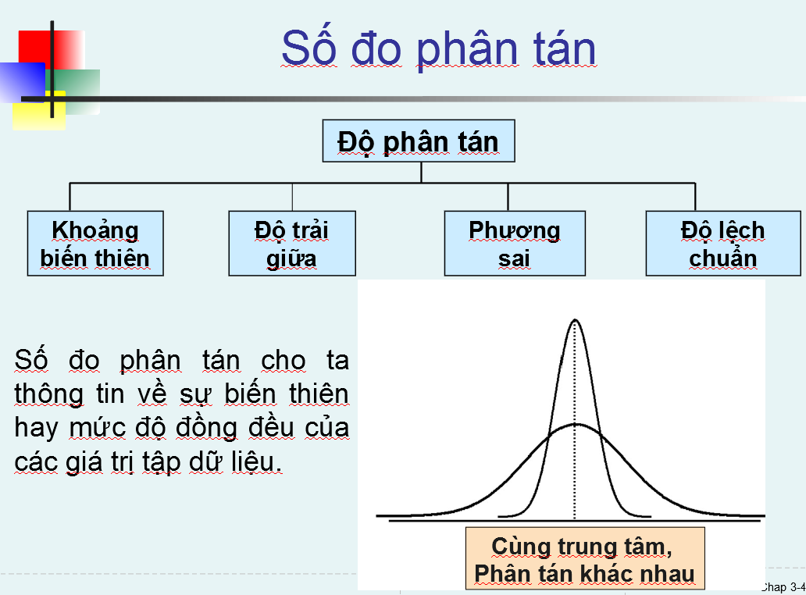
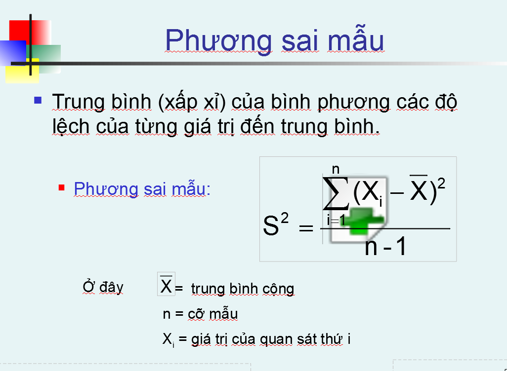
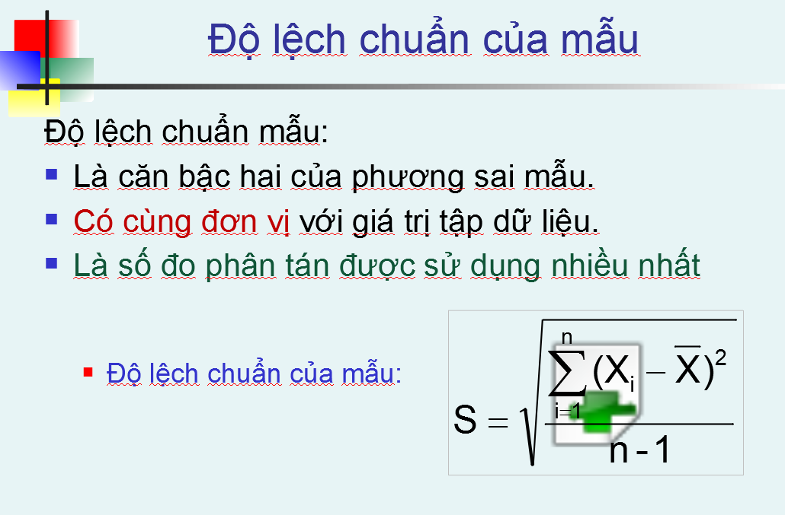
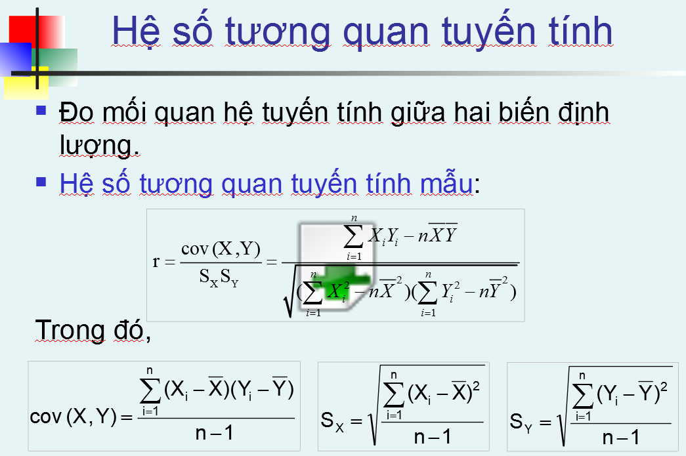

# Mean - Trung bình cộng
- Là số đo hướng tâm phổ biến nhất
- Dễ bị ảnh hưởng bởi outlier

# Median - Trung vị
- là giá trị ở chính giữa tập dữ liệu
- không bị ảnh hưởng bởi outlier

# Mode
- Là giá trị xuất hiện nhiều nhất của tập dữ liệu

# Which is the best

# Số đo phân tán

# Phương sai mẫu

# Standart Deviation - Độ lệch chuẩn
là đơn vị thường dùng nhất để đo phân tán

# Hệ số tương quan 
- Để đo mối quan hệ tương quan tuyến tính giữa 2 biến
- trong khoảng từ [-1, 1]

