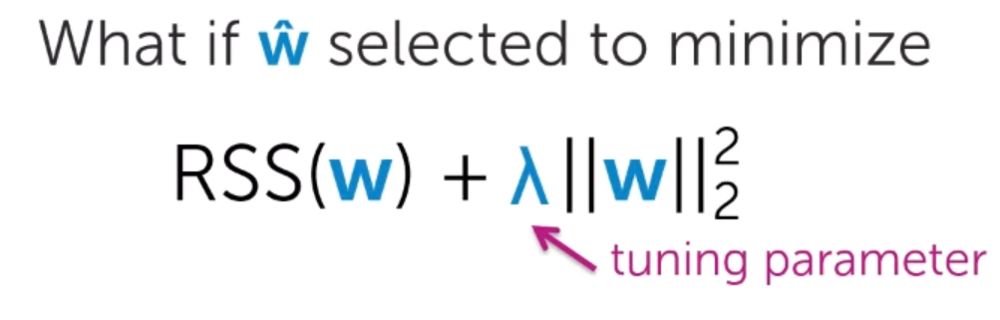

# 1, Balancing fit and magnitude of coefficients
A good model should balance between:
- How well function fits the data
- Magnitude of coefficients (avoid over-fitting)

The magnitude of regression coefficients should be measured by **Sum of squares (L2 norm)**

So this is the new objective to minimize, we introduce a **tunning parameter** to consider between which is more important to balance

Lambda and W-hat

