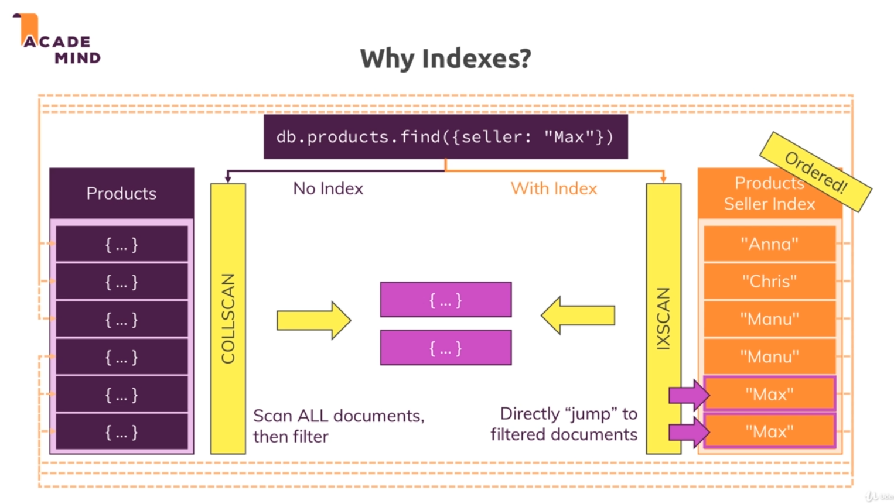

### When no index, the query need much time to scan all documents to find the right one

with indexes, everything is in ordered



### Create an index

view time to run query when not using index
```
db.contacts.explain("executionStats").find({"dob.age": {$gt: 60}})
```

add index to dob.age,
1, -1 is the order

```
db.contacts.createIndex({"dob.age": 1})
```

### What does createIndex() do in detail?

Whilst we can't really see the index, you can think of the index as a simple list of values + pointers to the original document.

Something like this (for the "age" field):

```
(29, "address in memory/ collection a1")

(30, "address in memory/ collection a2")

(33, "address in memory/ collection a3")
```

### Configuring index
```
db.contacts.createIndex({email: 1}, {unique: true})
```