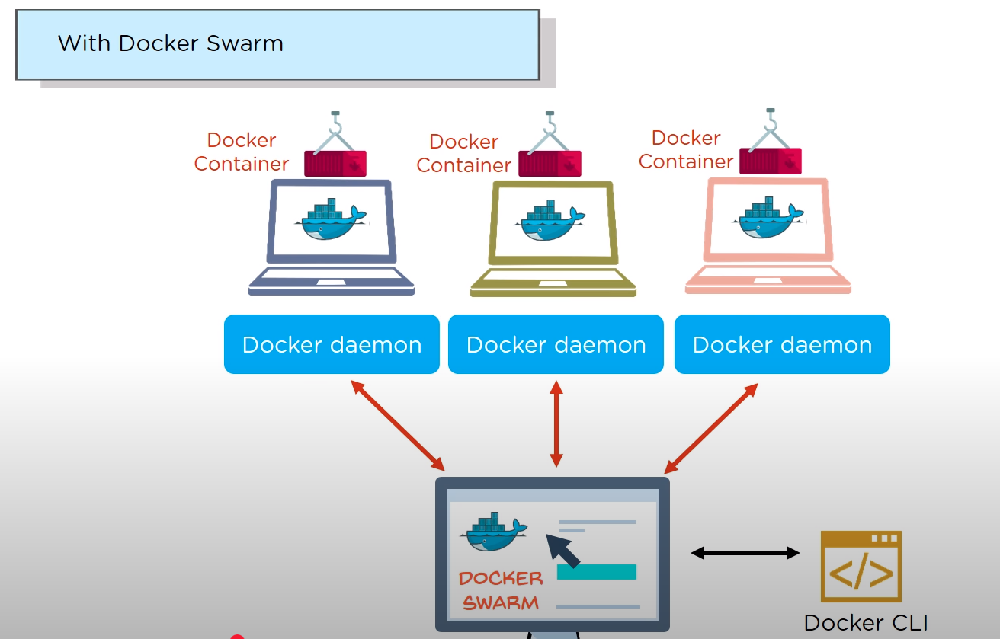

### Việc các container hoạt động độc lập với nhau, khi có lỗi xảy ra ở một container sẽ gây bất đồng bộ với các container khác -> hệ thống chạy không đúng

### Swarm sinh ra để giải quyết vấn đề đó

#### Thay vì mỗi container hoạt động độc lập trên một CLI như bình thường, thì chúng sẽ được thống nhất bởi một manager là Swarm.

### Swarm có thể update một container độc lập mà không cần phải tạm dừng toàn bộ hệ thống. Khi ở một container có lỗi phát sinh, Swarm sẽ có cơ chế backup lại toàn bộ hệ thống để tránh bất đồng bộ