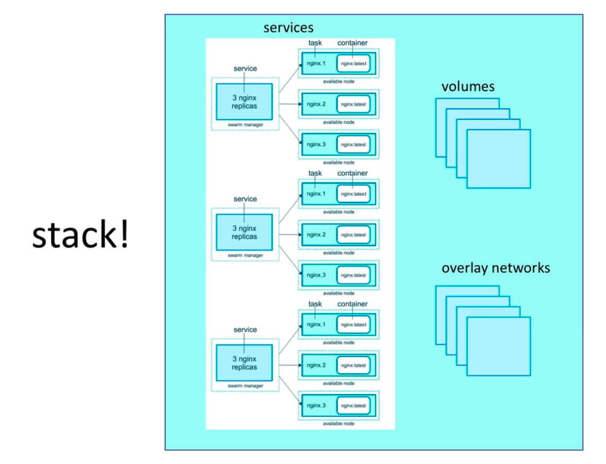

### Stack make creating multi services more effiecient

### when creating sevice normally
`docker service create --name vote -p 80:80 --network frontend --replicas 2 bretfisher/examplevotingapp_vote`
`docker service create --name redis --network frontend redis:3.2`
`docker service create --name db --network backend -e POSTGRES_HOST_AUTH_METHOD=trust --mount type=volume,source=db-data,target=/var/lib/postgresql/data postgres:9.4`
`docker service create --name worker --network frontend --network backend bretfisher/examplevotingapp_worker`
`docker service create --name result --network backend -p 5001:80 bretfisher/examplevotingapp_result`

### When using stack, you can define all those services in only one file
view example-stack.yml for more info

### And deploy that stack with one command
`docker stack deploy -c example-stack.yml voteapp'