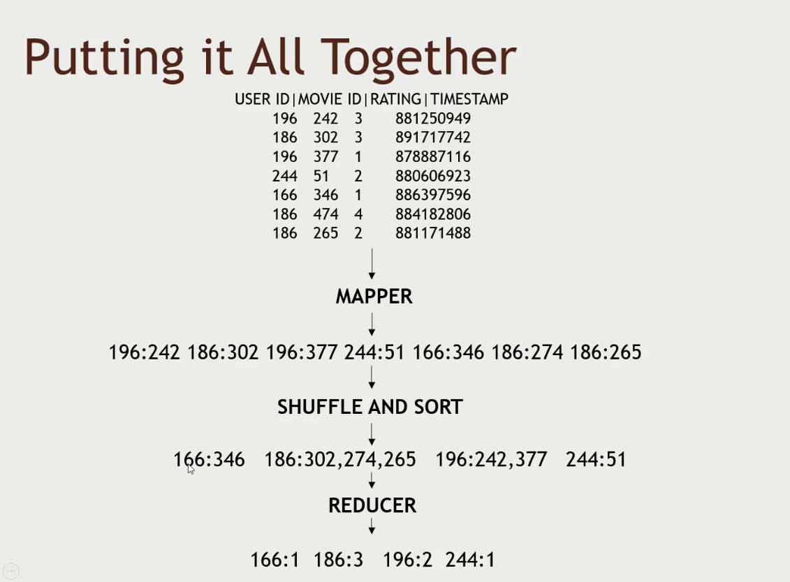
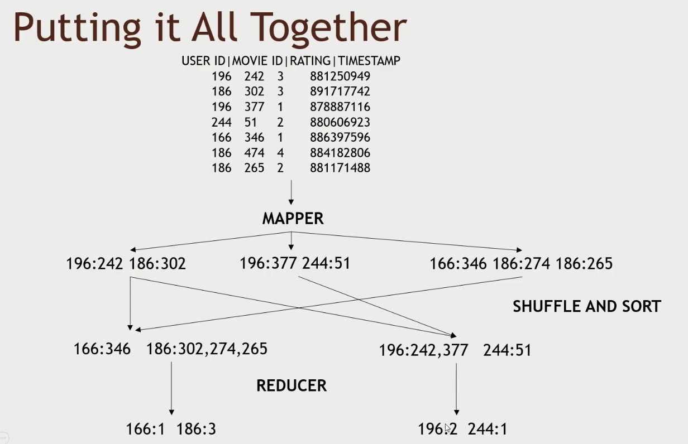
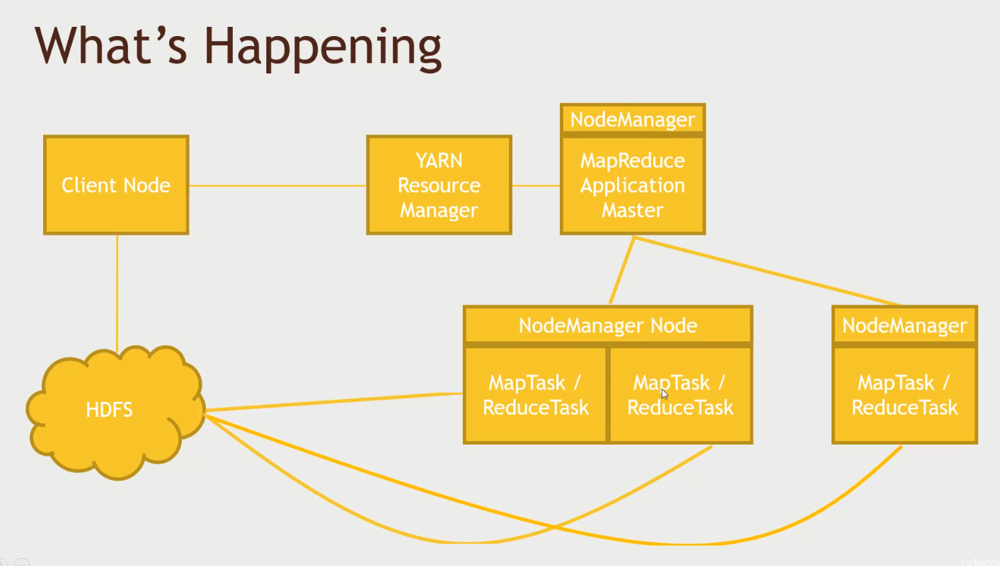

### Map - Reduce is the core principle of Hadoop

Put the data we need in cluster by Map function
The less we put in, the more ifficient.
So Map function will handle data transforming process.
Then go through some process.
Final data return by a Reducer

Each process can be distributed to some computer in the cluster

Simple Map - Reduce code

`
from mrjob.job import MRJob
from mrjob.step import MRStep

class RatingsBreakdown(MRJob):
    def steps(self):
        return [
            MRStep(mapper=self.mapper_get_ratings, reducer=self.reducer_count_rating)
        ]

    def mapper_get_ratings(self, _, line):
        (userID, movieID, rating, timestamp) = line.split('\t')
        yield rating, 1

    def reducer_count_rating(self, key, values):
        yield key, sum(values)

if __name__ == '__main__':
    RatingsBreakdown.run()
`