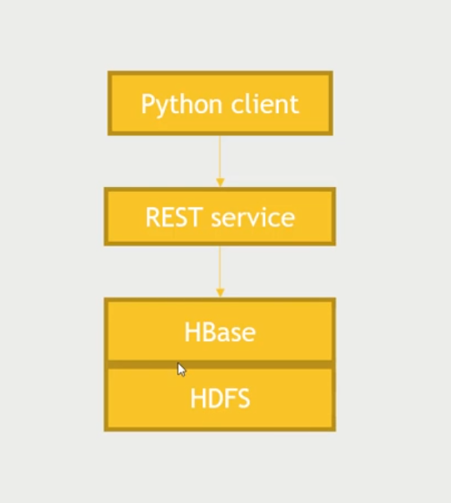

### Relational database like MySQL is design to run query, that's good for analytics.
But in case of Big Data, joining tables together to get target data is very compicated. So with easy jobs, we use NoSQL

HBase is based on HDFS, we CRUD data with API, no query language



### To communicate with HBase
first we open a port on virtual machine for HBase service
```
/usr/hdp/current/hbase-master/bin/hbase-deamon.sh start	rest -p 8000
```

then communicate using python client
```
	searching for hbase python client for more info
```