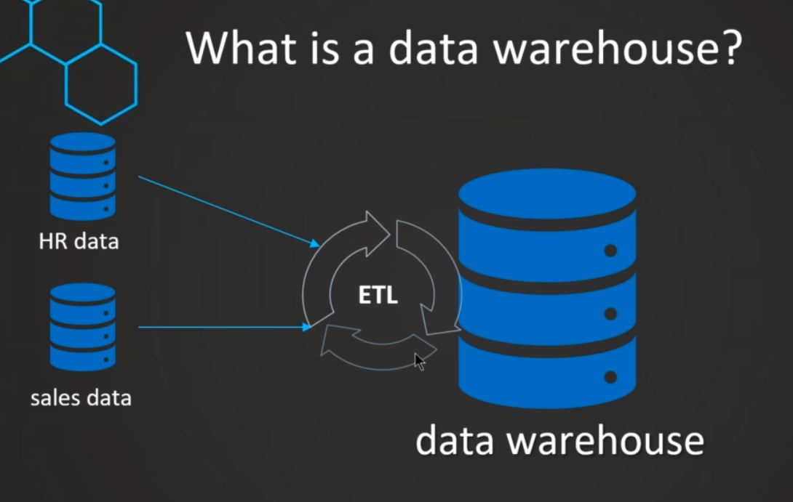
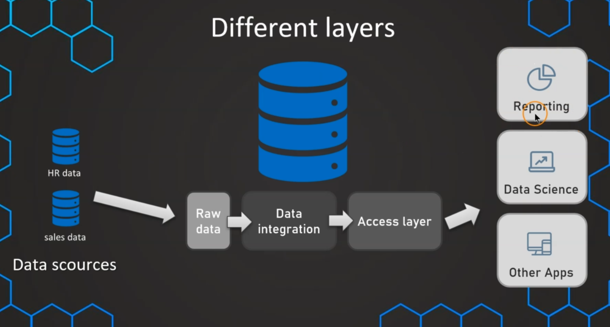

### Normal data in production is not ready or allowed to be integrated or researching on it

so we must create another database called Data Warehouse for analizing

## the process of integrating data together call ETL - Extract, Transfrom and Load

