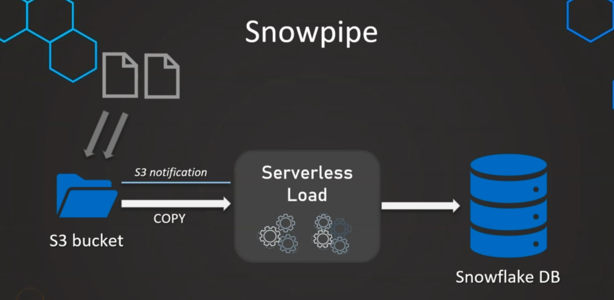

### snowpipe enable loading once a file appears in a bucket. Use snowpipe if data needs to be available immediately for analysis



### create a stage with snowpipe

```
// create table
create or replace table manage_db.public.employees (
    id int,
    first_name string,
    last_name string,
    email string,
    location string,
    department string
);

// create file_format object
use manage_db;
create or replace file format csv_format
    type = csv
    field_delimiter = ','
    skip_header = 1
    null_if = ('null', 'null')
    empty_field_as_null = true;

// create stage object with integration object and file_format object
create or replace stage manage_db.external_stages.csv_folder
    url = 's3://snowflakes3bucket123/csv/snowpipe'
    storage_integration = s3_int
    file_format = manage_db.public.csv_format;

list @manage_db.external_stages.csv_folder

// create schema
create or replace schema manage_db.pipes;

// define fipe
create pipe manage_db.pipes.employee_pipe
    auto_ingest = true
as
copy into manage_db.public.employees
from @manage_db.external_stages.csv_folder;
```
