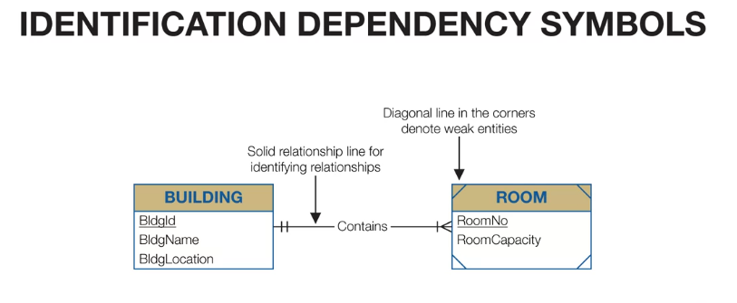
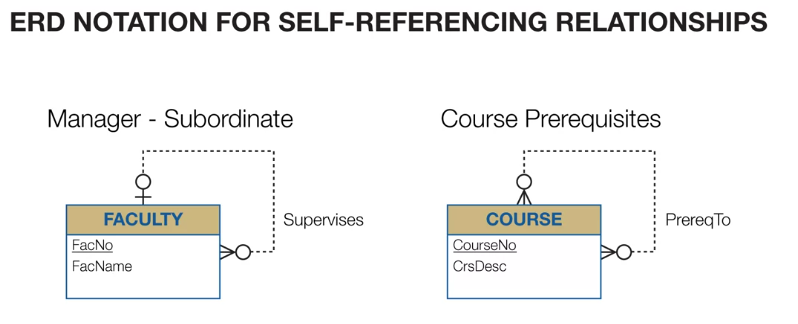
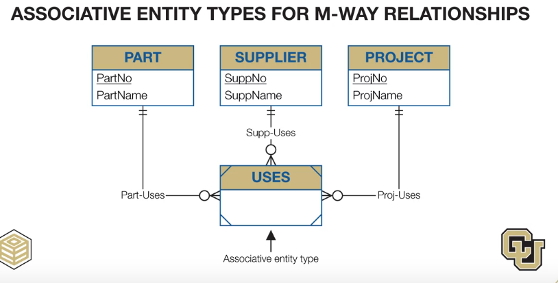

# Identification Dependency 
đây là kiểu phụ thuộc mà ngầm mặc định thực thể này được xác định bởi thực thế kia
vd: một phòng trong tòa nhà mặc định là thuộc trong tòa nhà nào đó và nó có thể được xác định bởi ID của tòa nhà

# Self-referencing Relationship
đây là kiểu mà một thực thể có thể phụ thuộc vào chính nó. vd: trong Employee có thể có các Manager

# M-way Relationship
đây là kiểu quan hệ có nhiều hơn 2 thực thể cùng tham gia. được biểu diễn gián tiếp qua các kiểu quan hệ 1-M

