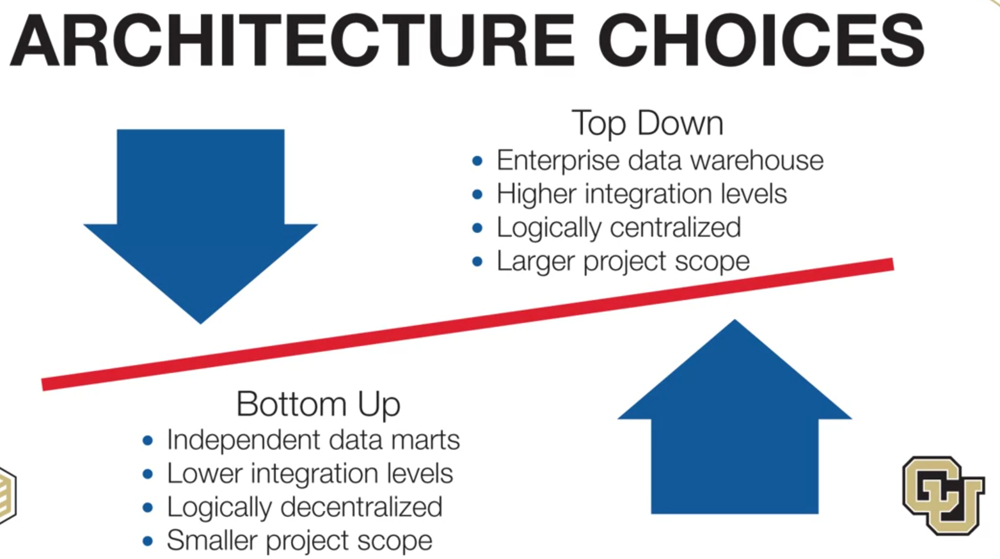
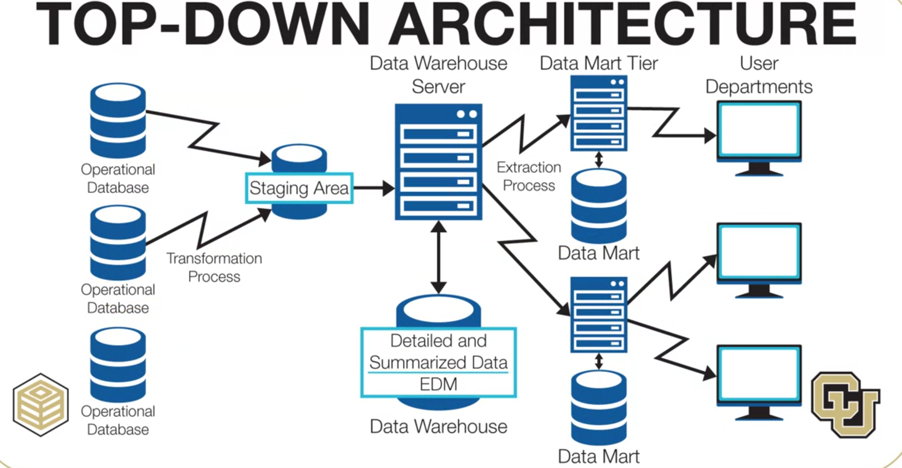
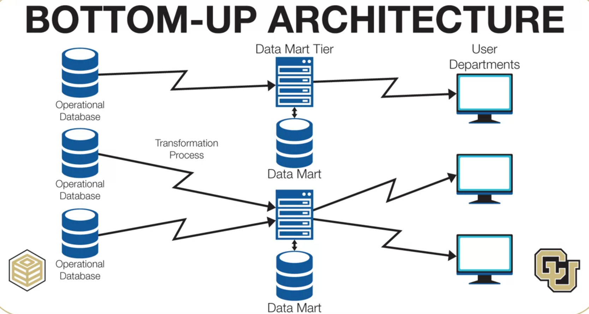
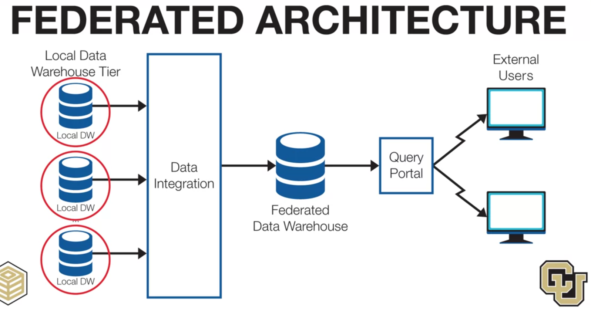
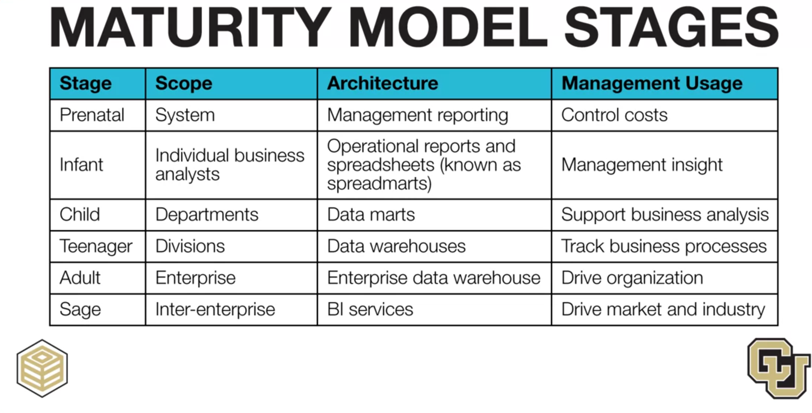

# Architecture Choice

when designing data warehouse, we should consider business business scope

# Designing Top-down architecture for large project

# Bottom-up for small scope with dependent data marts

# Federated Architecture

   

# Maturity Stages
