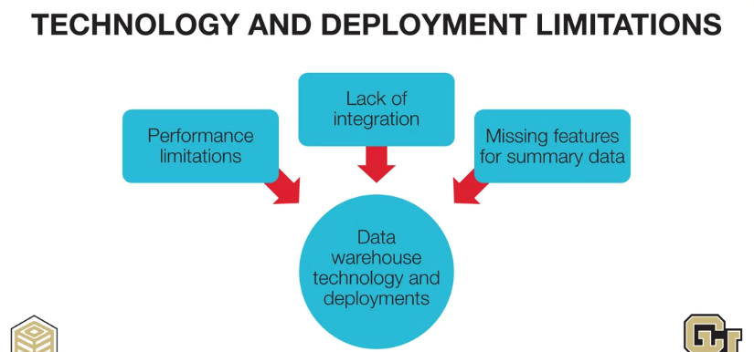
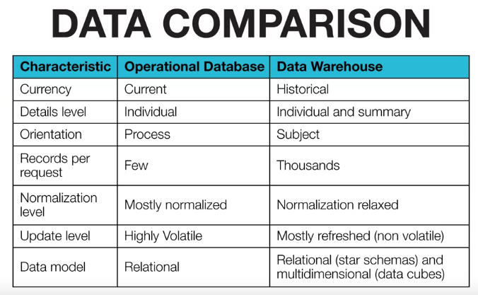
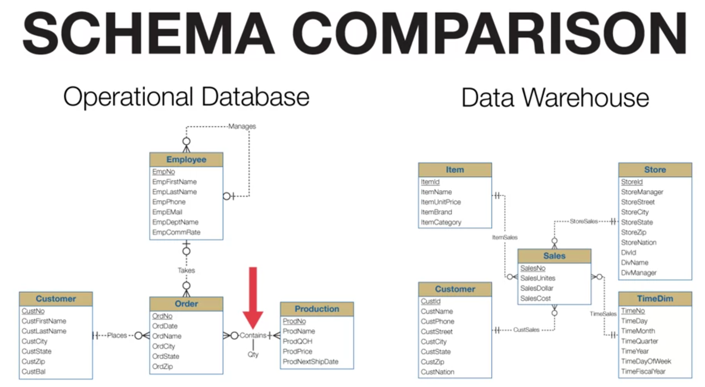

# Why do we need data warehouse
because of the limited in technology and organization we must create a new data repository specially used for analyzing data, which is the data warehouse

# Different between Relational Database and Data Warehouse

