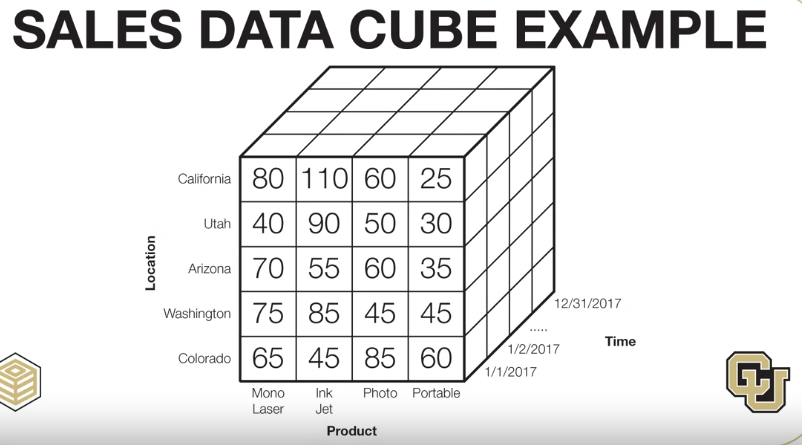
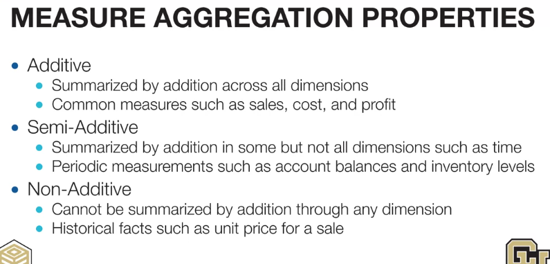
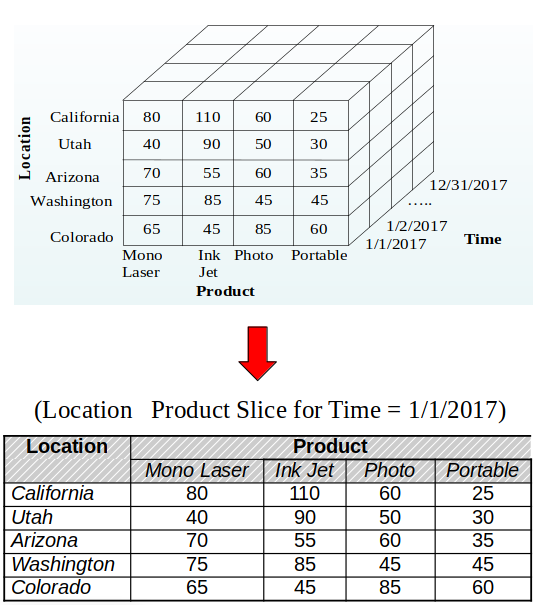
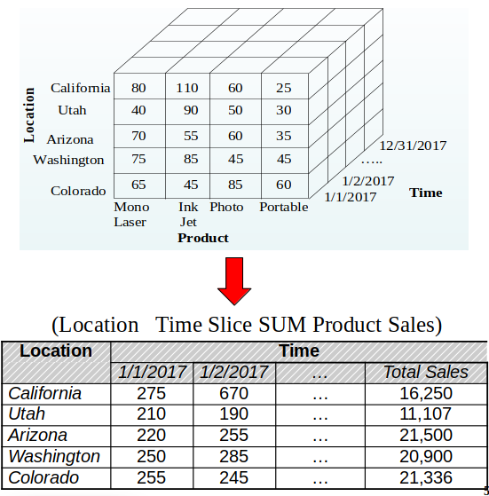
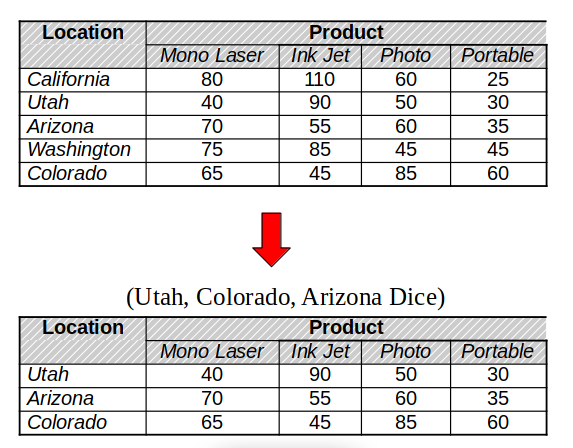
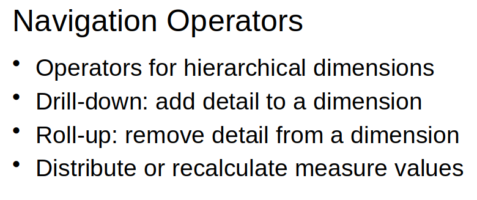
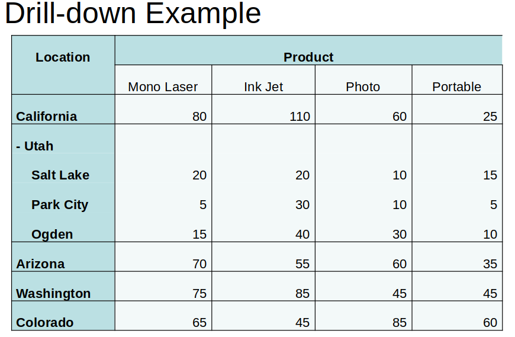
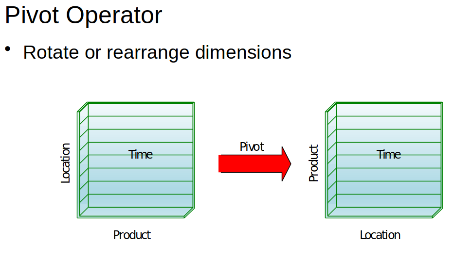

# Data Cube
Data cube is a 3-d data model that can be applied aggregate function on some or all dimensions to calculate some meanings

# Operations on Data Cube

### 1, Slide - Get a subset of dimensions

### 2, Slide Summarize - Slide and make a summarize on a dimension

### 3, Dice - Replace one dimension with a subset

### 4, Navigation Operators - Get up or down in the dataset

### 5, Pivot Operator - Rotate dimensions

