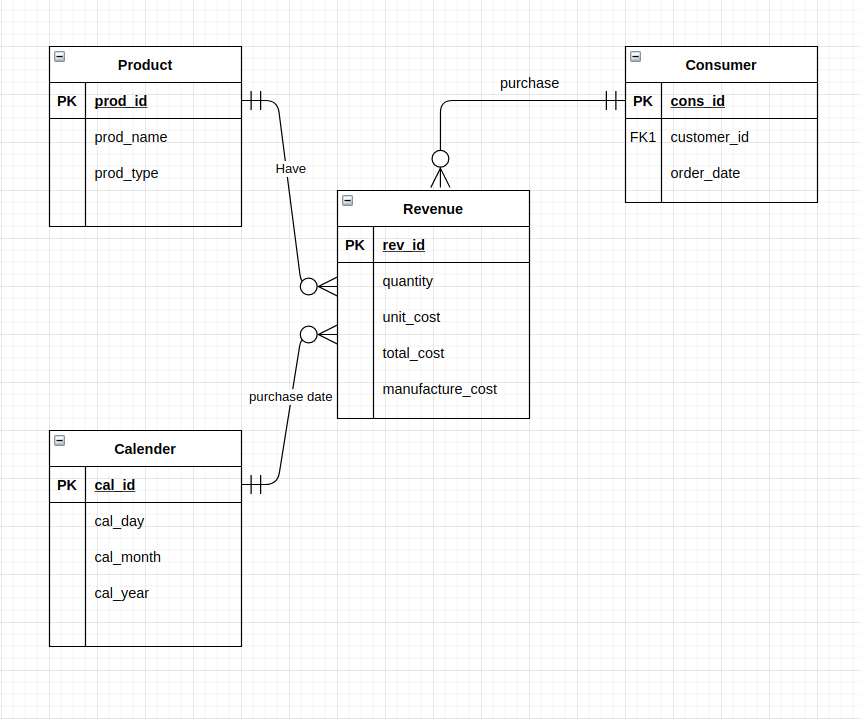
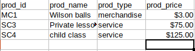
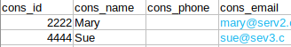
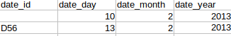
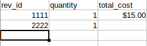

# 1, We can divide all those table to 3 types to tracking revenue database
- Product: represents for all services or products our business supply. Such as ServiceCategory, Merchandise and MemberType.
    - prod_id: ERD only,
    - prod_name: Franchise table, MemberType table, Merchandise table
    - prod_type: ERD only, hierarchical (location → category → unit price)

- Consumer: represents for people or businesses that use our products or services
    - cons_id: ERD only
    - cons_name: Member table, Franchise table
    - cons_email: ERD only, hierarchical (top level domain → second level domain → local part)
    - cons_phone: ERD only, hierarchical (country code → area code → prefix → line)	
- Calender
    - Date columns in the ERD (MmbrDate, SaleDate and ServPurchDate)

# 2, We can measures on mostly Member and ServicePurchase talble
	- MemTypePrice for each member (MemberType table): additive measure
	- ServCatPrice for each purchase made by customers: additive measure
	- Merchandise quantity in Sales: additive measure
	- Sale price for members or product types: additive measure

# 4

# 5, Summarizability potential problems
- MmbrEmail and MmbrPhone can be missing if we are not careful when collecting member data.
- The price for MerchPrice, ServPrice and MemTypePrice can be outdated when using additive measure for a long period 
- Some type-base value may have missing value when we add more or remove some of those
- The same member may have Purchase on the same Product, so we must be careful when integrating these two values

# 6, Example

### Product table

### Customer table

### Date table

### Fact table
