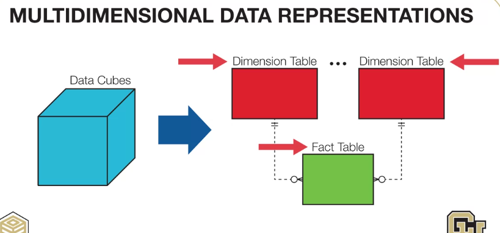
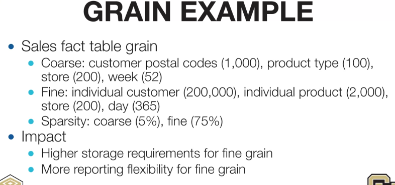

# Multi-Dimensional Data Representation

# What is "Grain"
- Grain is the "Finest" level for a fact table
- Determined by the finest level of each dimension
- Trade off:
  - Flexibility and Size
  - Better for analytics
  
# Grain example

