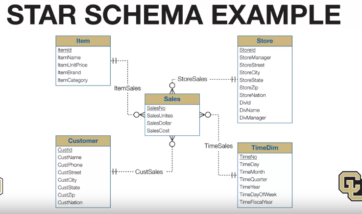
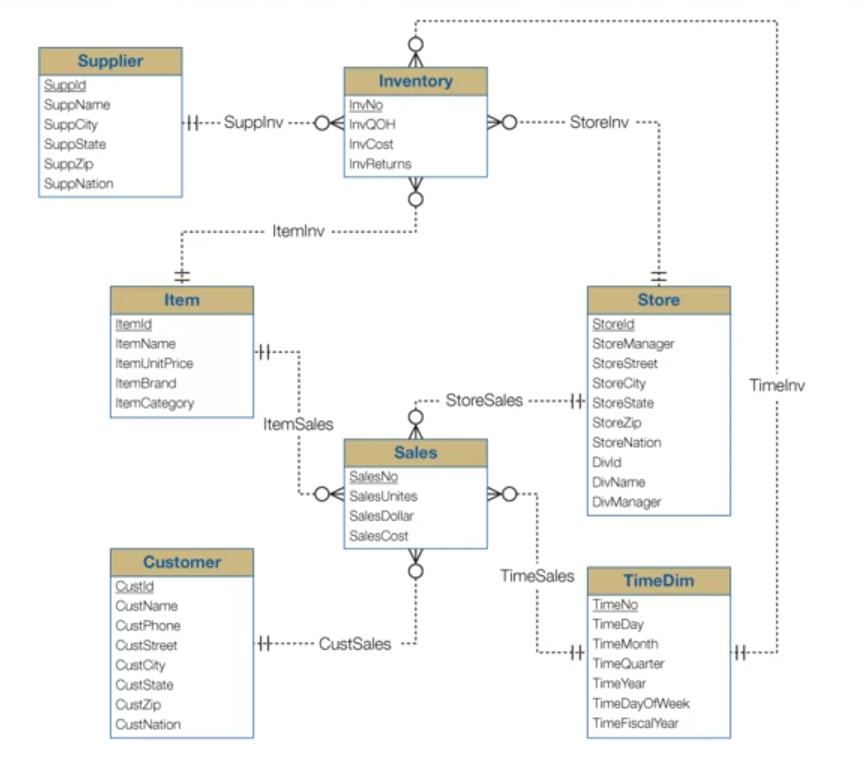
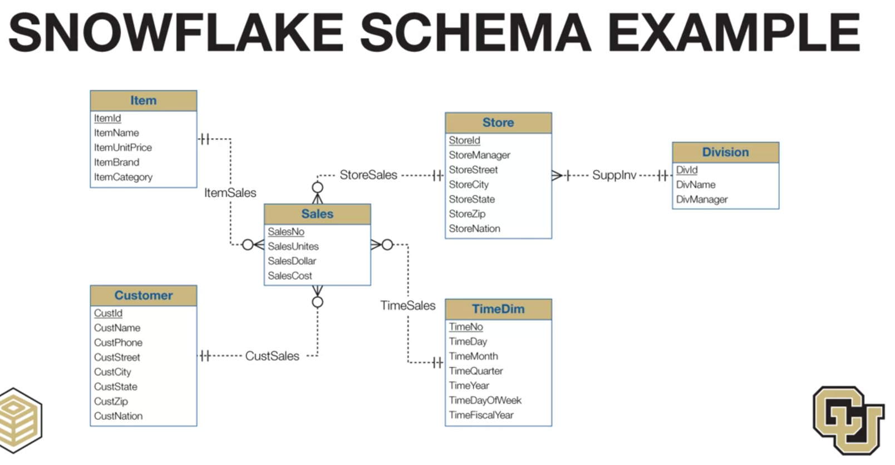

# 1, Star Schema
### Star Schema focus on a fact table reference to other dimension table in 1-M relationship 

# 2, Constellation Schema
### Constellation Schema is an expand of Star Schema, with the same Dimension Table used for more than one Data Cube

# 3, Snowflake Schema

