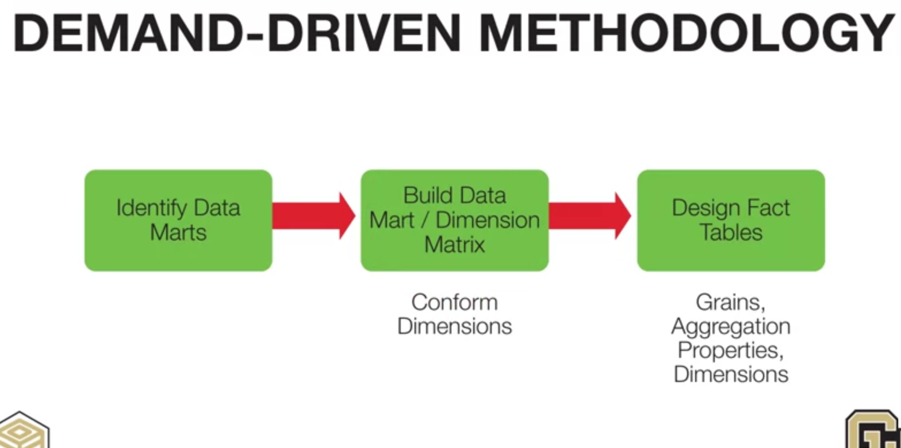
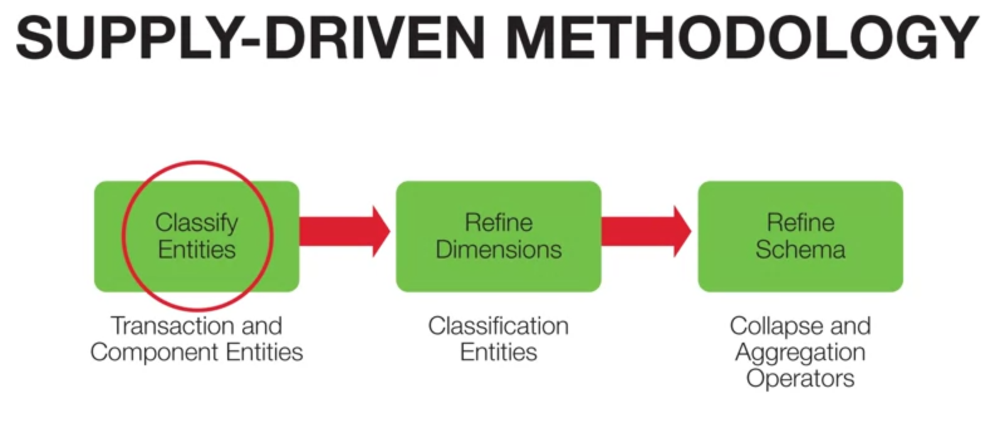
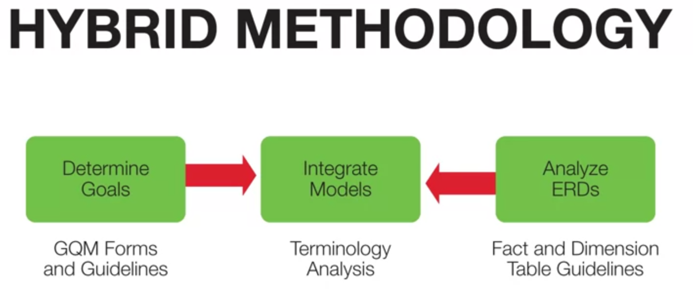

# Demand-Driven Methodology
#### 1, Identify Data Marts
Data Mart is a subset of Data Warehouse focus on a particular line of business

#### 2, Identify dimensions for Data Marts
- Standardize dimensions
- Matrix relating Data Marts and dimensions

#### 3, Design fact tables
- Define grain
- Determine details of dimensions
- Define measures

# Supply-Driven Methodology

#### 1, Classify entity types
- Transactional entity types: event
- Component entity types: related to events in 1-M relationships
  
#### 2, Refine dimensions
- Classification entity types: related to component entity type in 1-M relationship
- Dimension hierarchies for component/classification entity types

#### 3, Refine schemas
- Collapse
- Aggregate

# Hybrid Methodology
Hybrid methodology integrates the Demand-Driven stage in Supply-Driven stage.
Demand-Driven stage collect requirements. Then identify entity types representing facts and dimensions. And create star schemas (supply-driven) 
#### 1, Collect user requirements
- Use Goal/Question/Metric approach
- Develop dimensions and measures (Demand-Driven)

#### 2, Analyze existing ER diagrams
- Identify entity types representing facts and dimensions
- Create star schemas (Supply-Driven)

#### 3, Integrate star schemas
- Convert schemas to common methodology
- Match demand and supply models
   

