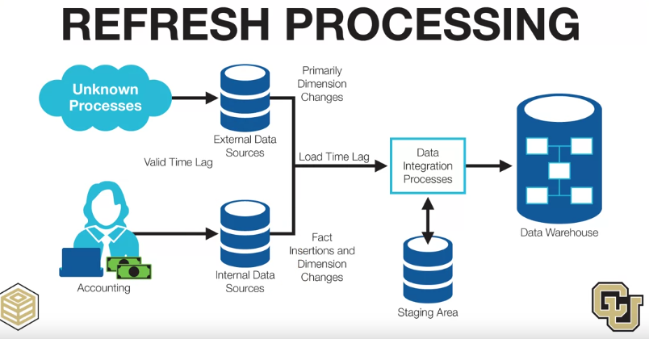
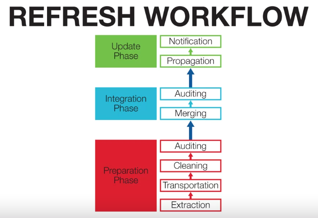
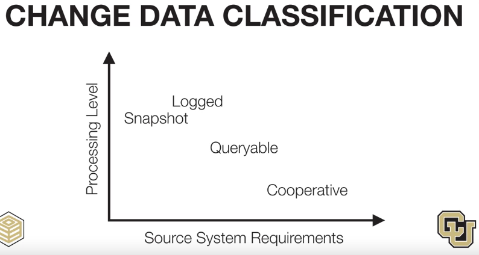
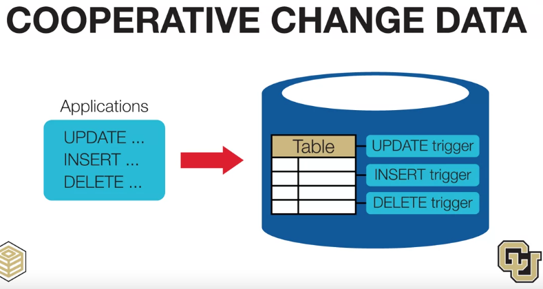
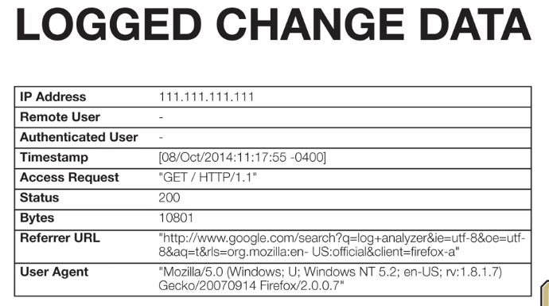
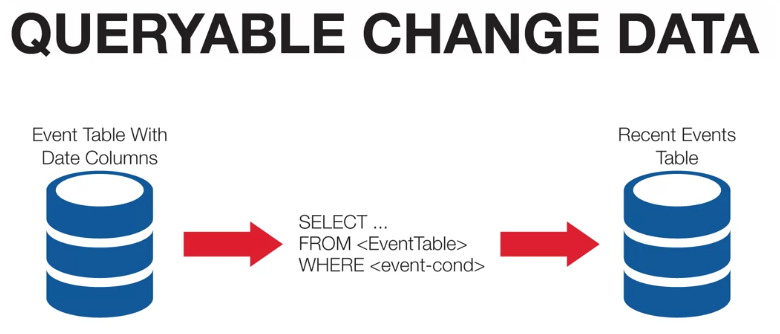
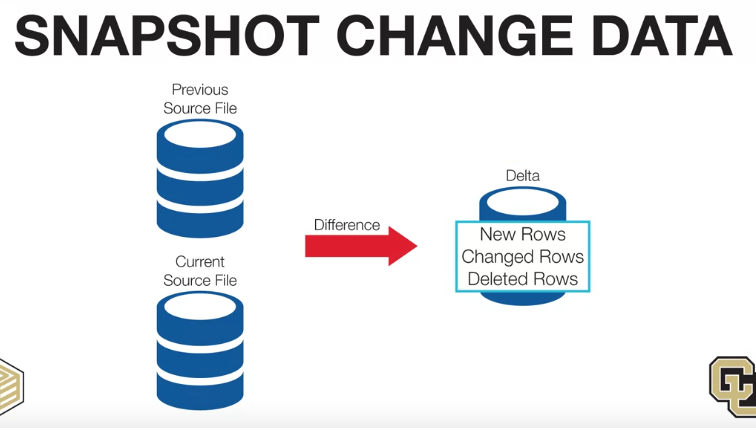

# Refresh processing
Refresh process is to integrate new data into current system

# Types of Data Source

### 1, Cooperative Change Data
When application make changes with data, the DBMS can trigger to immediately update those data into the Data Warehouse

### 2, Logged Change Data
Logged data can be used to track actions made in system

### 3, Queryable Change Data

### 4, 
Snapshot change data can track changes without any source requirement. But retrieving a source file can be intensive and also may be constraints about the time for doing it.

