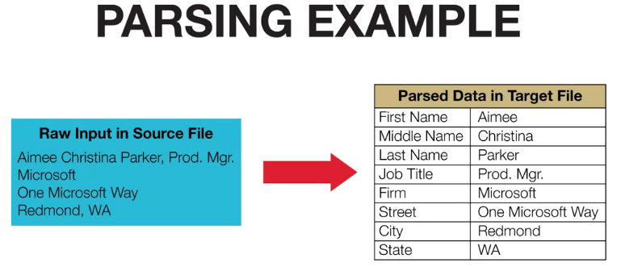
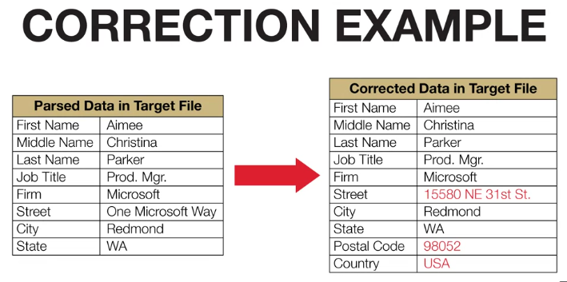
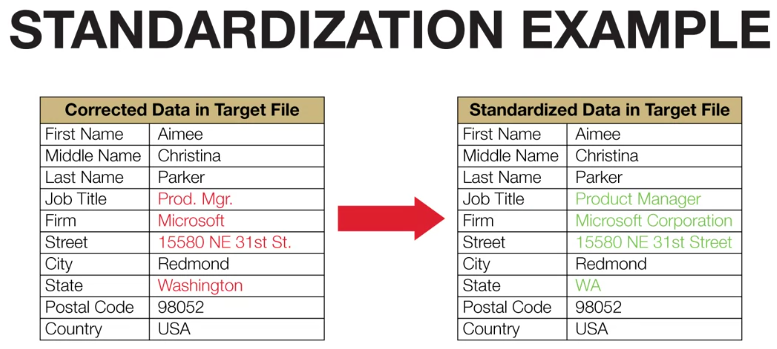

# 1, Parsing
Parsing is the process locating and separating data elements in text. For example, address field can contain some other elements such as street number, street name, city, state

# 2, Correcting Values
There are some way to deal with missing values
- Set default value for inapplicable values
- Use typical value: average, median or mode
- Predict missing values using relationships to other fields (data-mining technique)

# 3, Standardization
- Apply conversion routines to transform data into preferred format
- Use both standard and custom business rules

