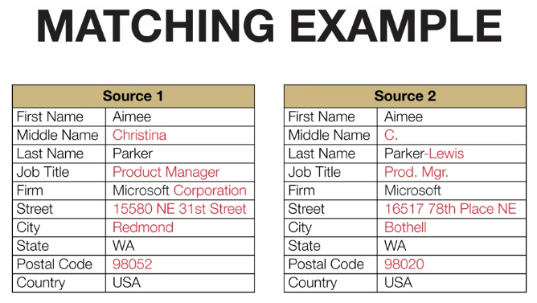
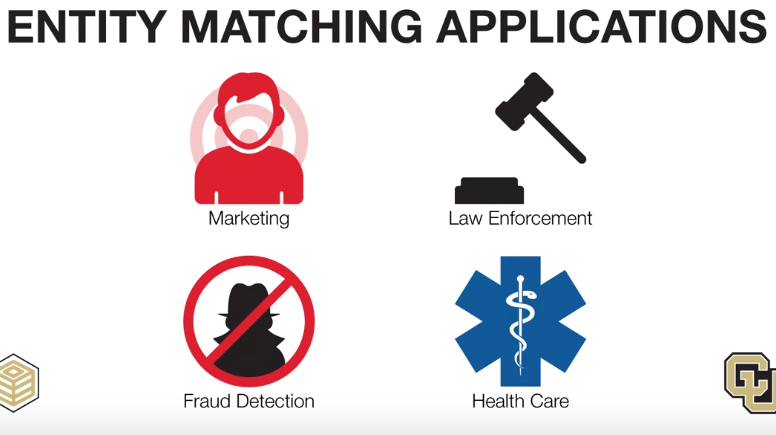
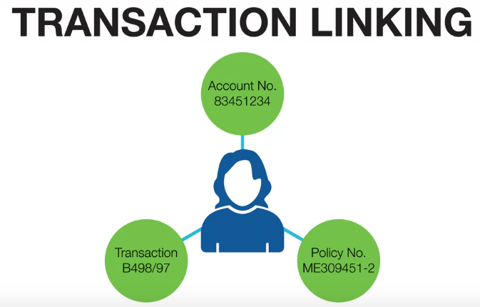

# Entity Matching
Entity matching is the process identifying common entities from separate data sources. It can be a data mining problem results in better data quality

# Consolidation
We can merge matched records or make some relationships between them.
After consolidating, we can get deeper knowledge about that entity

