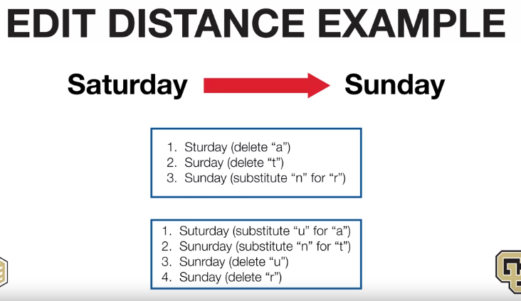
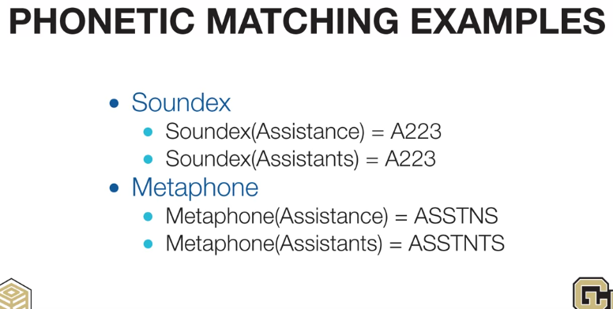

# Distance Function
Determine amount of space between records or values
# Edit Distance Function
## Known as the Operations to transform two text values, ex: a -> b - 1 operation
- Delete
- Insert
- Transform
*Edit Distance counts as the minimum number operations*

# Phonetic Distance Function
## Known as code words into standard consonant sounds, widely used in Data Integrating tools
- Soundex: 6 consonent sounds
- Metaphone: 16 consonent sounds

