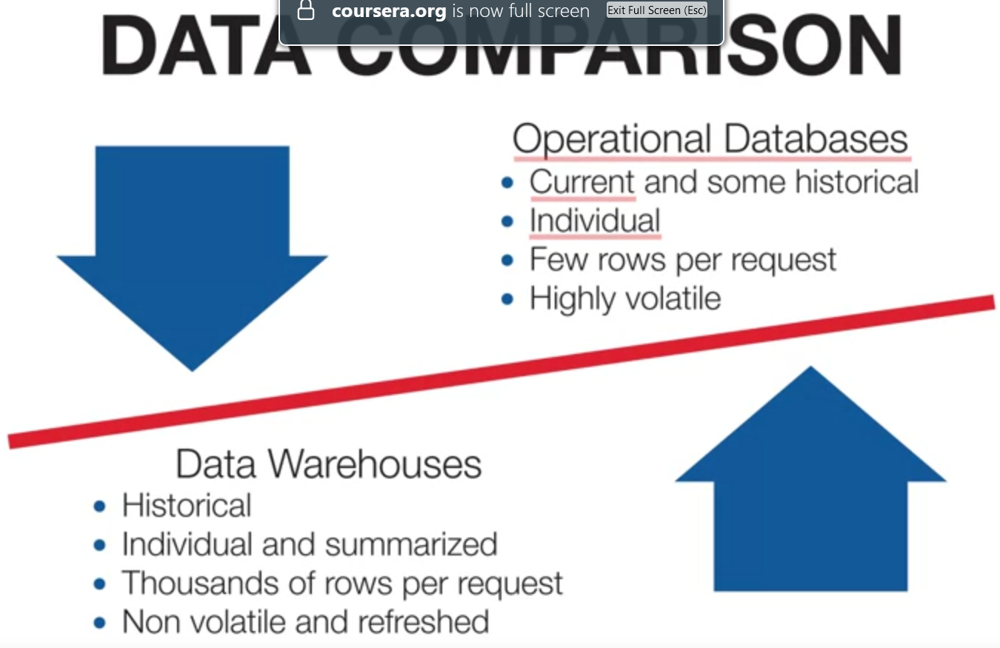
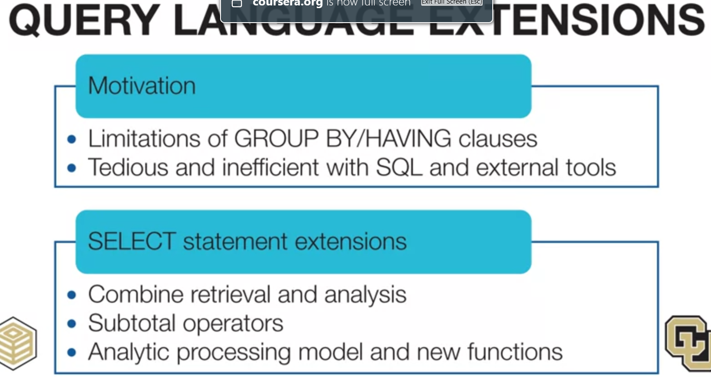
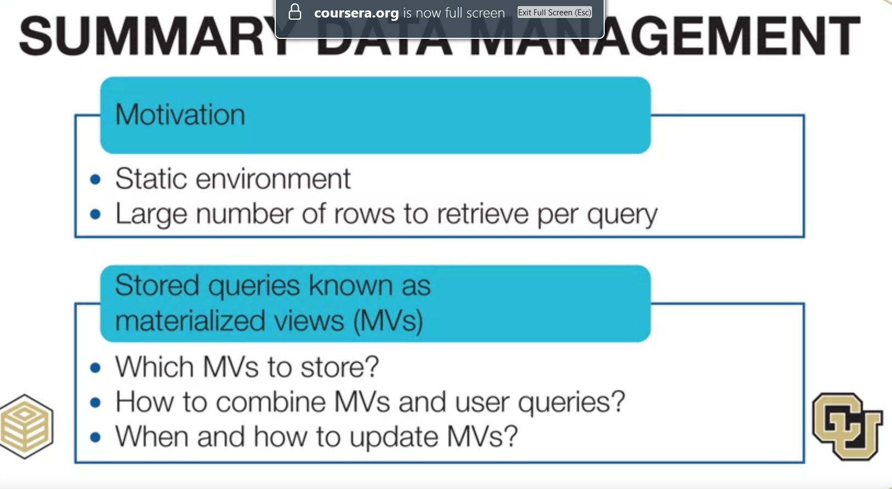
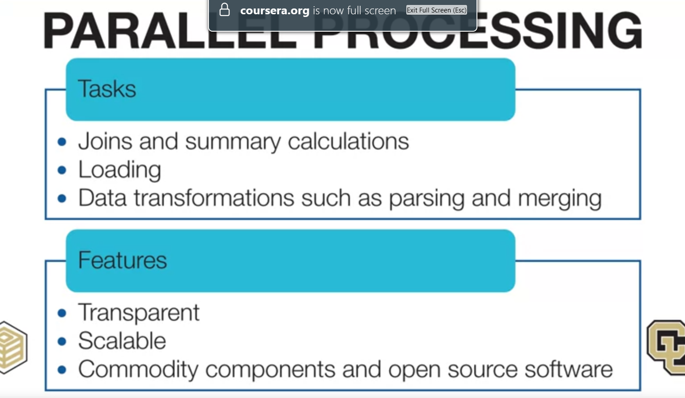

# DBMS Requirement

# Relational DBMS Improvements
Relational DBMS have improved many new features for business intelligent processing 
- Query language extensions
- Summary data management
- Parallel processing
- Loading and transformation (instead of using separated integration tools)

# Query language extensions

# Summary data management

# Parallel processing
