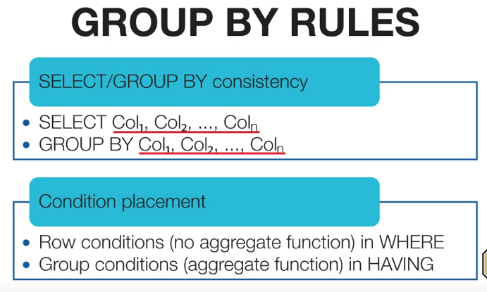
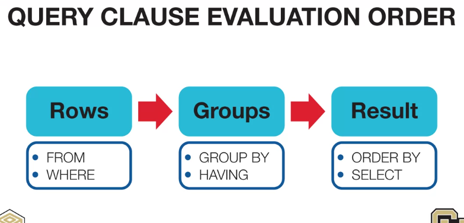
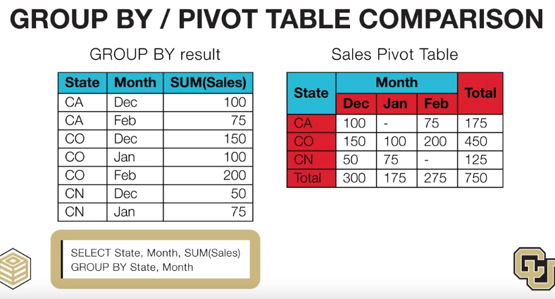

# Group by rules
- Columns appear in SELECT must appear in GROUP
- Row conditions in WHERE
- Group conditions in HAVING
  

# Evaluation Order
### Grouping only occurs one time

# Group by vs Pivot table

### Group by can handle missing values better than pivot table

