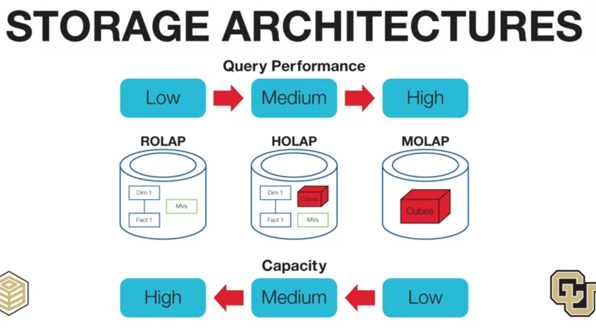
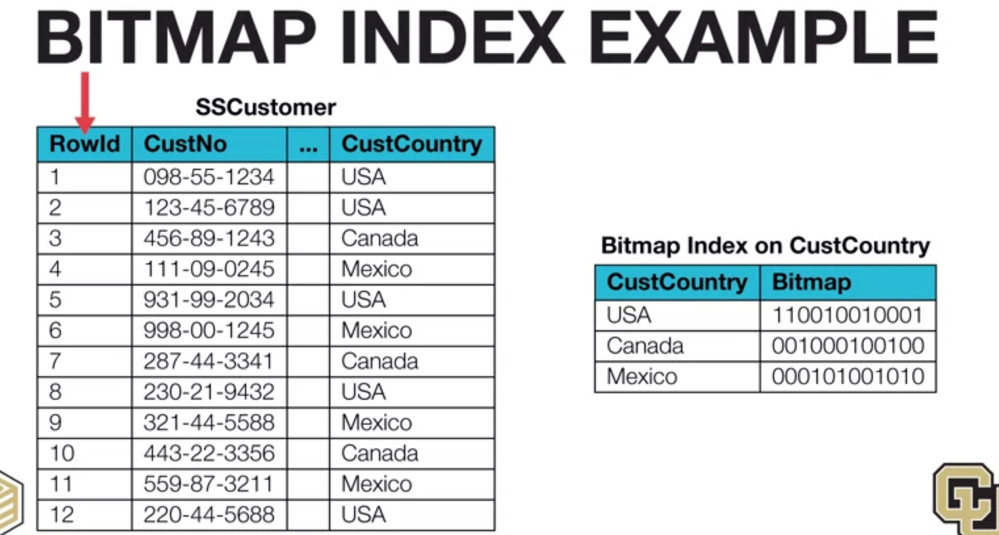
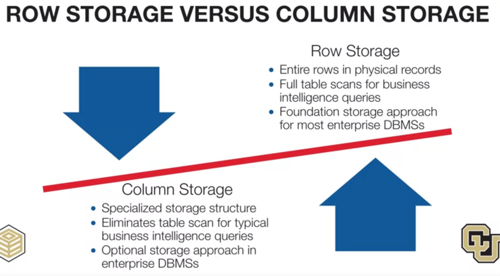
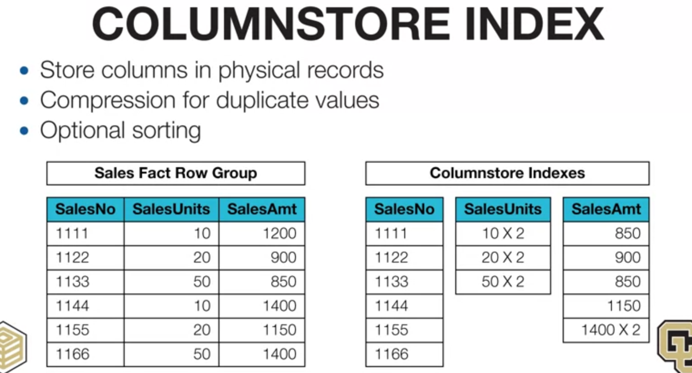

# 1, Storage architectures
The storage technologies support online analytic processing, or OLAP for short.
A generic name, applied to business intelligence capabilities, for data cubes. 

### MOLAP
- Multi-dimensional OLAP, directly manipulate stored data cube.
- MOLAP provide high performance because of optimizations for queries, using pre-computed data cubes
- But large size data cubes is the limit of MOLAP

### ROLAP
- Relational OLAP approach data cubes are dynamically constructed from fact and dimension table as well as materialized views.
- A subset of data cubes must be constructed in user query
- 

# 2, Bitmap index
Bitmap index useful for stable columns with few value.
Use string of bits: 0 - match, 1 - no match 

# 3, Column storage
Each column stored in a file.

