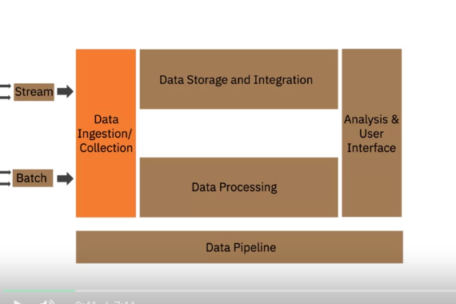

### Data collection layer

-   connect to data sources
-   transfer data from data sources to data platform in streaming and batch modes

###### Tools

-   Data Flow
-   IBM Streams
-   kafka

### Data Storage

-   store data for processing and long-term use
-   transform and merge extracted data

###### Relational Databases

-   SQL Server
-   MySQL
-   Oracle
-   PostgreSQL

###### Other NoSQL databases or service

### Data Processing Layer

-   Read data in batch or streaming mode from storage and apply transformations
-   Provide a way to work with data

### Analysis and User Interface

-   Querying tools and API to get data
-   Dashboard for BI

### Data Pipeline payer
