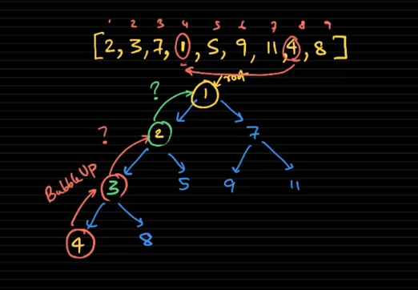
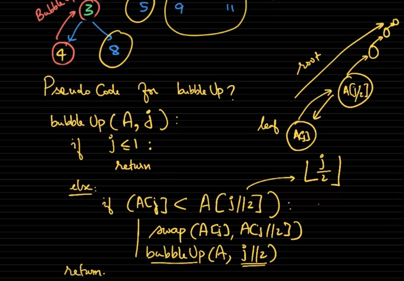
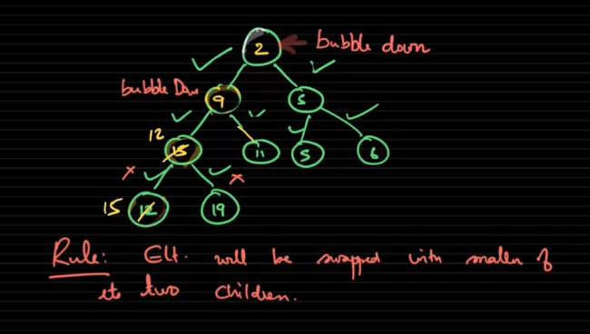

# Bubble up
When Heap has a failure, it can automatically fix it. If children is in wrong position with their parent, bubble up happen

### Bubble up pseudo code

# Bubble down

When parent is in wrong place with their children, we need to bubble down with the parent, not consider bubbling up their children

