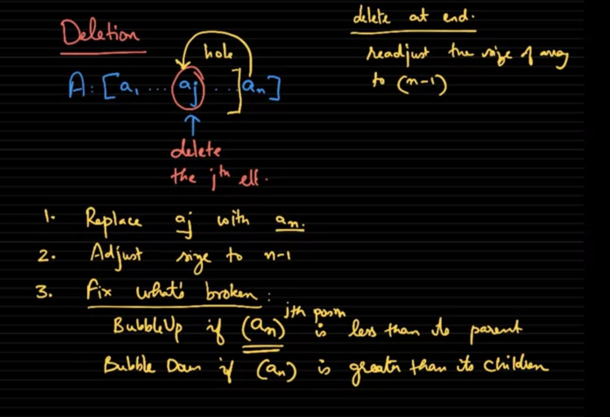

# Heap Operation
### 1, Insert
- Append to the end of heap array
- BubbleUp it

### 2, Delete
- Delete i tem a[i]
- Move a[n] to a[i] left hole
- Fix what's broken

# Priority Queue
One of the best application of heap is PRIORITY QUEUE. Once new element inserted into heap, the heap will automatically fixed

# Heapify
Turn a normal array into a Heap
- Move from end to start
- Bubble down each element

### The last half of the array do not have children, so actually only first half of the array be moved 

# Heap Sort

- Heapify A
- for i = 1 to n
  - insert a[i] to result
  - delete a[i]

### Note that we can save the space used by recycled the seen part of original array

