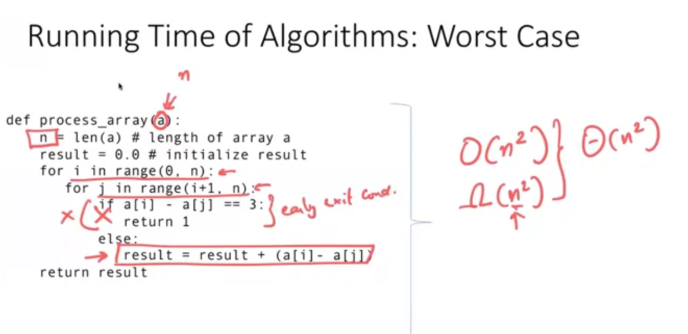

# Some Algorithms mostly run on worst case  

For some reason, most parts of the algorithm can not be reached, so it can be considered run on average time less than originally computed time

# Randomness in algorithms

Some algorithms use randomness, most of the time, it will have good case, but in the worst case, it takes long time to run.
Suppose that we have an algorithm need to roll a dice and compute base on result of that attempt, time complexity may variate from best or worst case

# Average time analysis

We can calculate average time complexity by multiple a case by it chance to happen then summarize all cases to one result

Ex: 1/3 chance to jump 1 and 2/3 chance to jump 2.
So the average time complexity is 1/3 * 1 + 2/3 * 2 = 5/3

