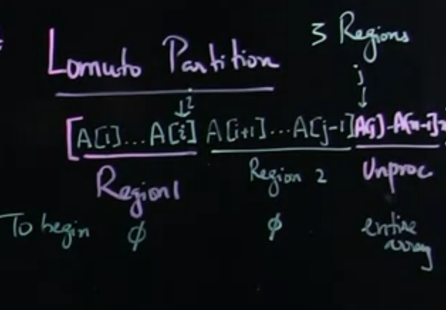
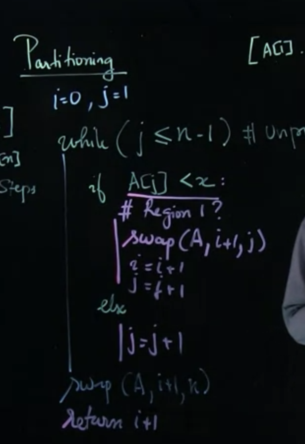
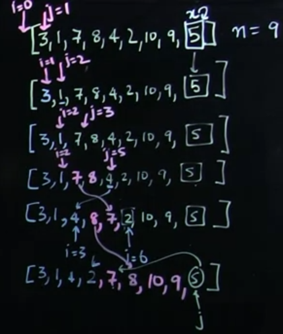

# 1, Lomuto Partition
The main idea of Lomuto Partition is that you can divide original array into 3 parts, with x is the last element of the array:
- Less than x region
- More than x region
- Unprocessed region





```
def swap(arr, i, j):
    temp = arr[i]
    arr[i] = arr[j]
    arr[j] = temp

def lomuto_partition(arr):
    i = 0 
    j = 1
    n = len(arr) - 1
    x = arr[n]
    while(j < n - 1):
        print(i, j)
        if(arr[j] < x):
            swap(arr, i + 1, j)
            i = i + 1
            j = j + 1
        else:
            j = j + 1
        print(arr)
    swap(arr, i + 1, n)
    print(arr)
    return i + 1

lomuto_partition([3, 1, 7, 8 ,4 , 10 , 9 ,5])
```

