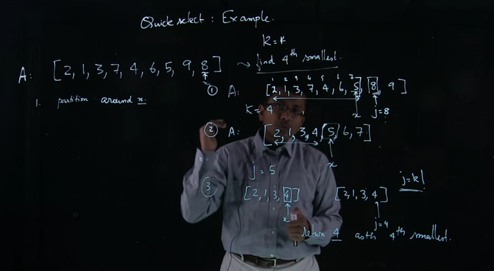

# Problem
### Given Array A[A[1], ...., A[n]]
### Find the K-th smallest in A

Simple approach: Sort the array, then find A[k]

# Quickselect approach
Quickselect is an algorithm for finding K-th element using Quicksort

pseudo code:
Find pivot x = A[n] (or some random x).
Then x will be in the right place j of the array (Lomuto partition)

case 1: j = k - found it -> return x

case 2: j > k - Quickselect([A[i], ..., A[j - 1]], K-th element)

case 3: j < k - Quickselect([A[j + 1], ..., A[n]], (k - j)-th element)



```
def swap(arr, i, j):
    temp = arr[i]
    arr[i] = arr[j]
    arr[j] = temp

def lomuto_partition(arr):
    print(arr)
    i = 0 
    j = 1
    n = len(arr) - 1
    x = arr[n]
    while(j <= n - 1):
        if(arr[j] < x):
            swap(arr, i + 1, j)
            i = i + 1
            j = j + 1
        else:
            j = j + 1
    swap(arr, i + 1, n)
    return i + 1

def quick_select(arr, k):
    n = len(arr)

    j = lomuto_partition(arr)
    print('j', j)

    if(j == k):
        return arr[j]
    
    if(j > k):
        return quick_select(arr[0 : j], k)
    
    if(j < k):
        return quick_select(arr[j + 1: n], k - j)

print(quick_select([3, 1, 7, 8, 4, 10, 9, 5], 1))
```