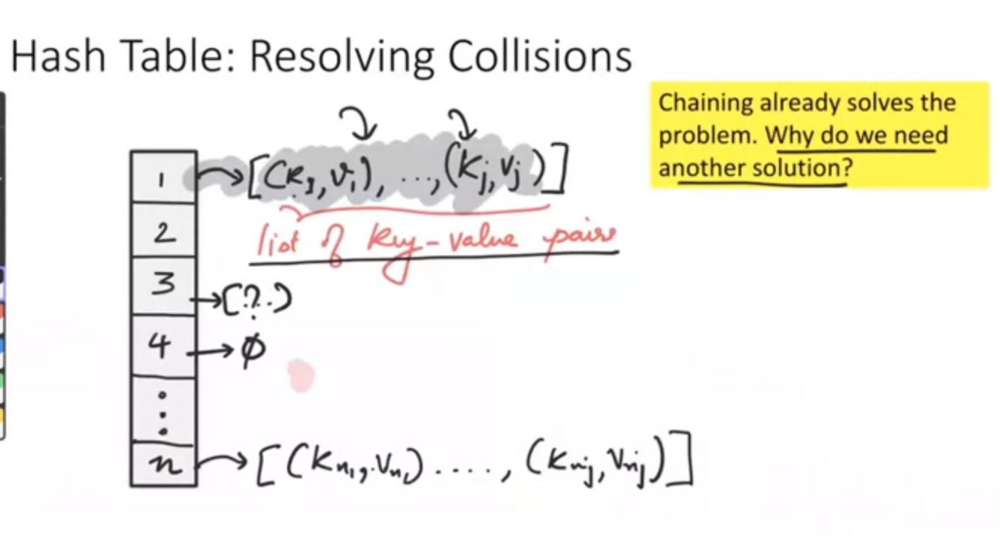
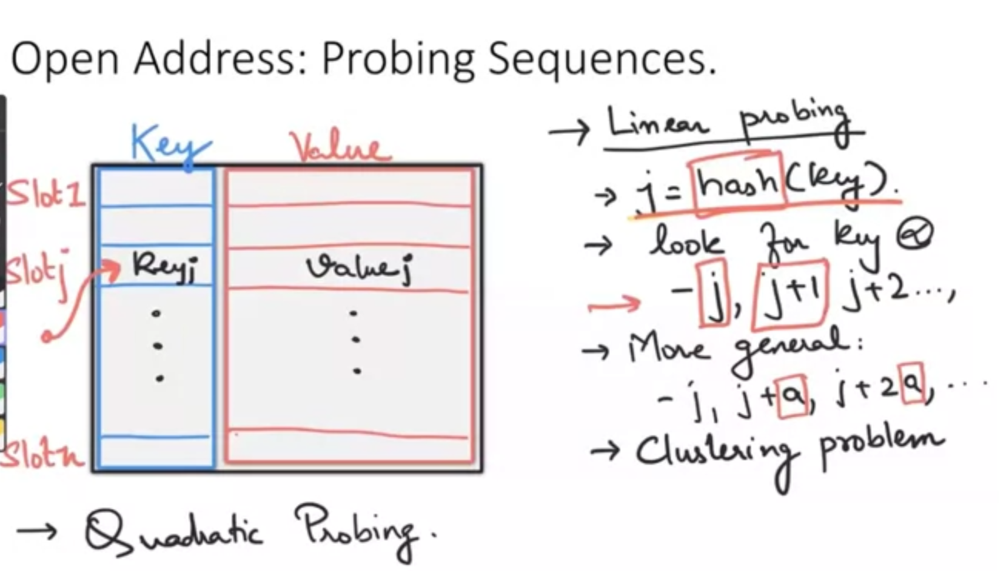
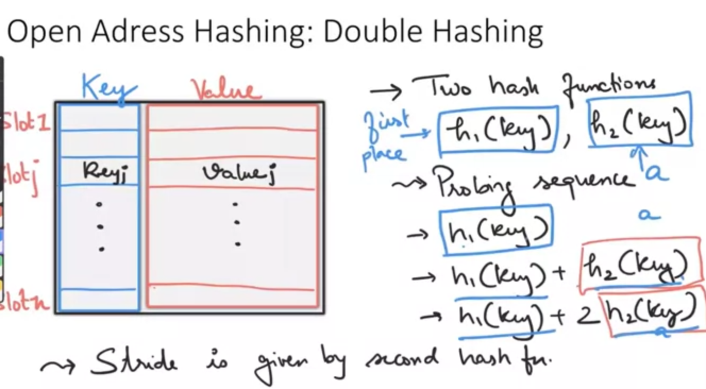

# 1, Chaining problem
Chaining can solves the collision problem, but it still cause another problem. That is the waste of some empty place inside hashtable

# 2, Open Address Hashing
The main idea is, when our key is occupied, lets choose an alternative, which later called the Probe Sequence

### But the probe sequence still cause another problem, when our Sequence is not much efficient, CLUSTERING can happen
Clustering is when sequence place things consecutively in next to each others, although there are many empty place after that

### QUADRATIC PROBING can solve clustering problem, by using a more randomize sequence

# 3, Double Hashing
Another way to deal with those problems is use another hash function

