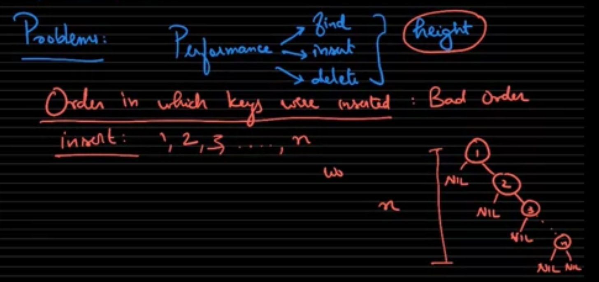
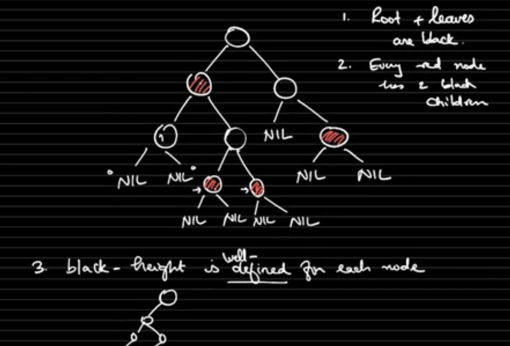
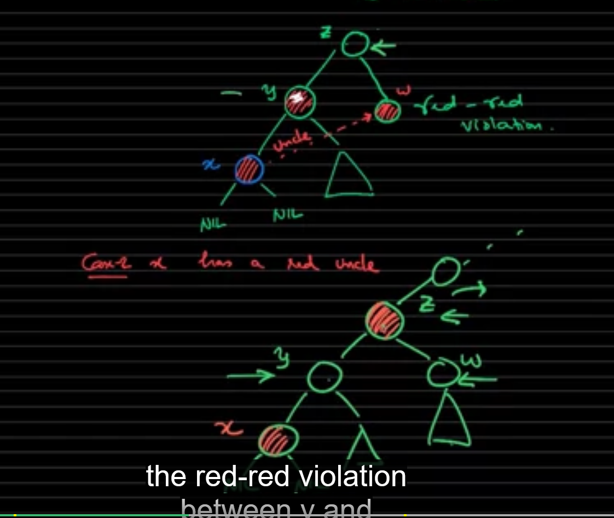
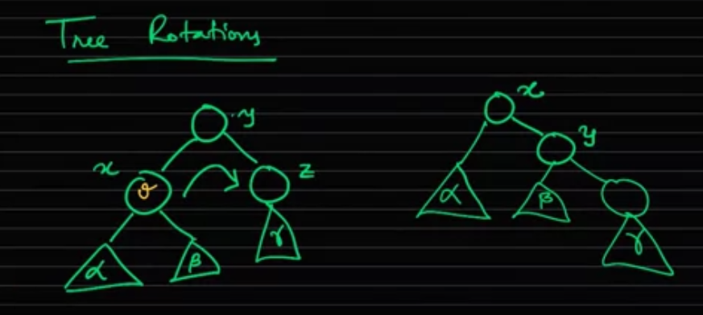

# Problem with BST
When insert an increment sequence (1, 2, 3, ..., n), the tree will become unbalanced

# Red - Black tree properties
### 1, Root and Leaves (NIL) are Black
### 2, Red node must have Black children
### 3, **Black height** on every path of a Node to a Leaf must be the same

# Insertion
First, find right position of newly inserted Node exactly like BST

### 1, Parent is Black -> We are done, no more operation

### 2, Parent is Red -> Do some more staff

## Case 1: Parent is Red and Uncle also Red
Just recursively recolor the tree

## Case 2: Parent is Red but Uncle is Black
Tree Rotation

