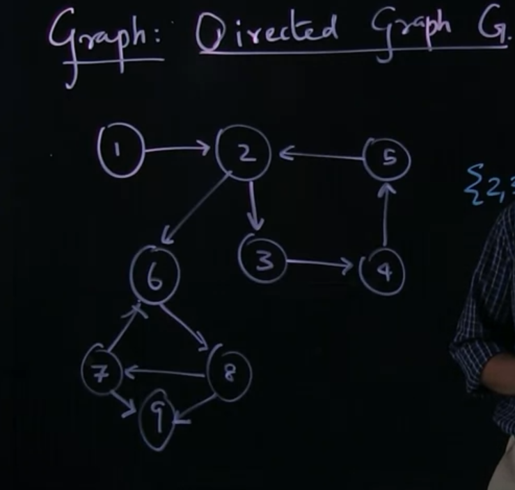
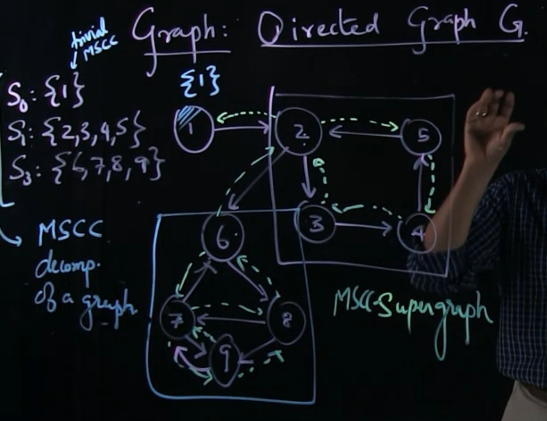

# Strongly Connected Components

A Strongly Connected Components - SCC is a subset of the graph in which every Edge can go to each other

Maximum Strongly Connected Components - MSCC is a SCC having maximum number of children it can have in case do not break the rule of SCC 

e.g: {6, 7 ,8} is a SCC. {6, 7, 8, 9} is MSCC

# Properties

## 1, Two MSCC of a graph must not share any Edge in common
if have, they can be combined to a larger MSCC, this **break the rule of MSCC**

## 2, All MSCC of a graph can be combined to a MSCC SUPER GRAPH 

Many algorithms are deployed based on this property

## 3, The reverse graph has the same MSCC

The transpose of adjacency matrix is the reverse version of graph. It must have the same MSCC

