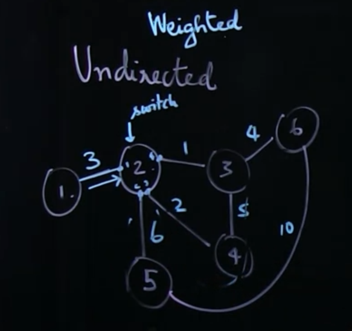
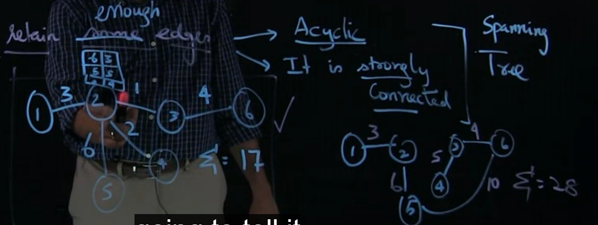
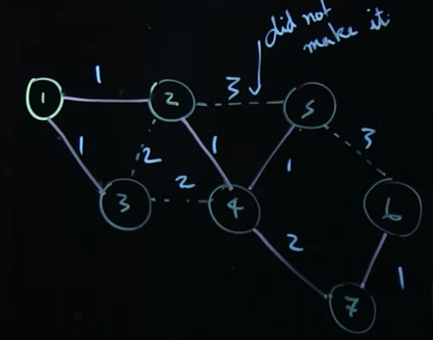

# Problem

In a undirected and weighted graph, transporting will take time to consider the way to go.
A Spanning Tree is a subset of the graph, still can go to entire edges but can reduce the total weight comparing to original graph

Further more, Spanning Tree can have a ROUTING TABLE, which can make it much more easily to choose the next edge to visit

# Minimal Spanning Tree

A minimal spanning tree is the one that can not, reduce any edge to make its total weight smaller

