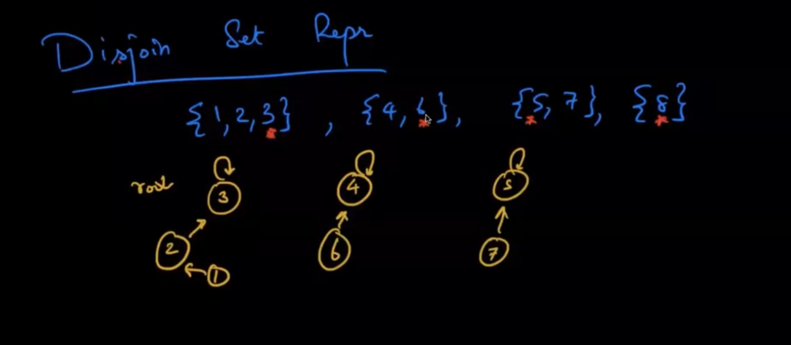
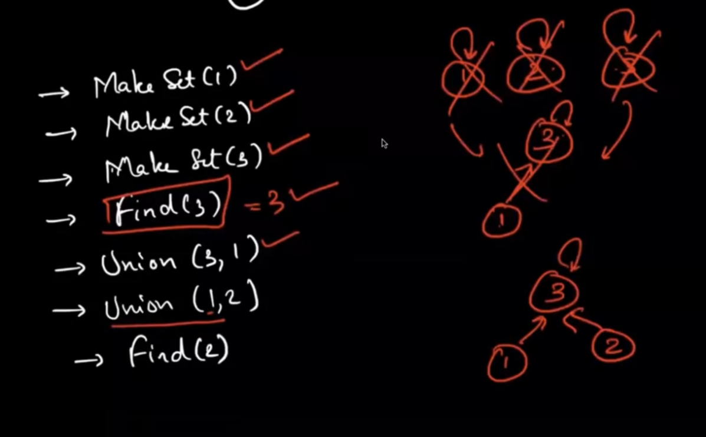
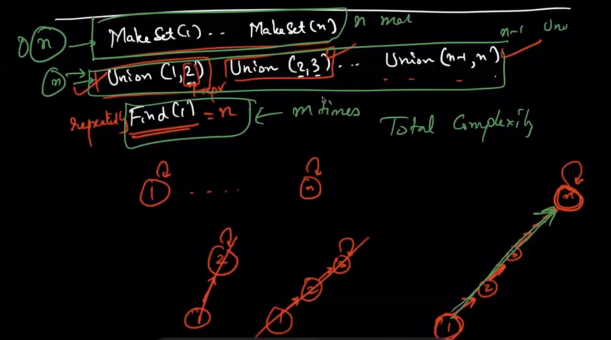
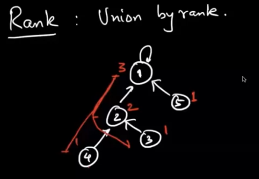

# Disjoin Set
Consider we have a family of disjoin set U = {1, 2, 3, 4, 5, 6}
S1 = {1, 2} | S2 = {3, 4, 5} | S3 = {6}

### Representation

Each disjoin set have a **Representative**, which is choosed by arbitrary

### Operations
An Union Find data structure require 3 basic operations:
- MakeSet({i})
- Find(1) = 3
- Union(2, 7) = {1, 2, 3, 5, 7}

### Problems
When find an Element, the worst case will need O(n) operations, which is not good at all

# Rank
The idea is define a disjoin set with rank 

