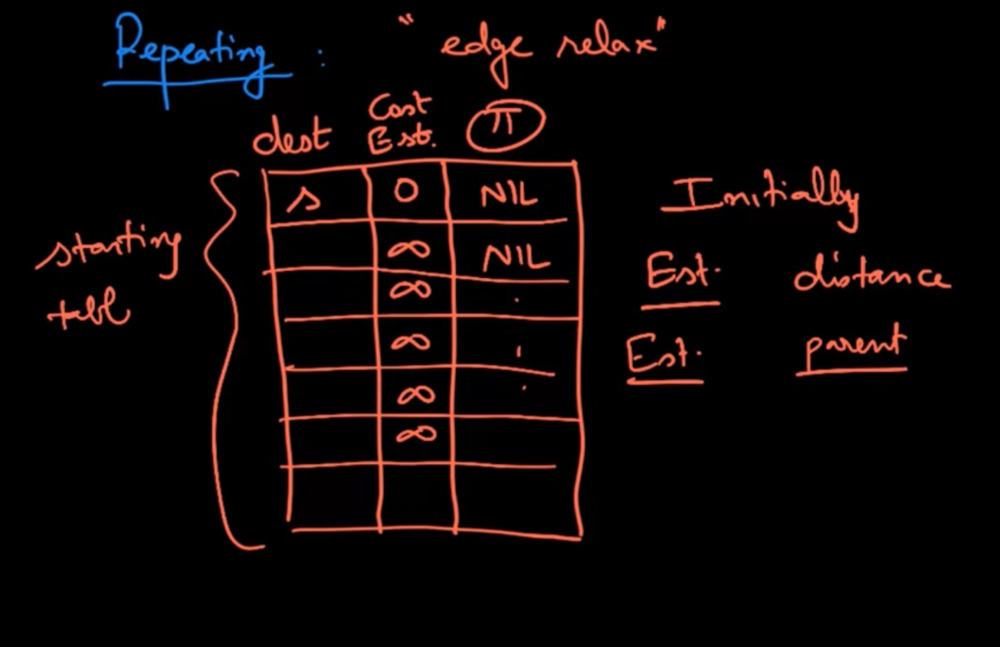
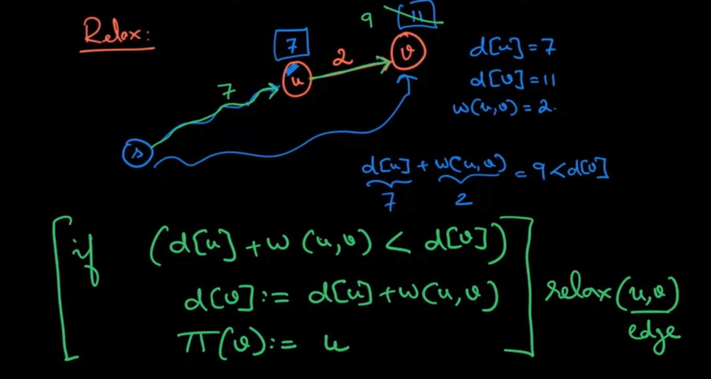
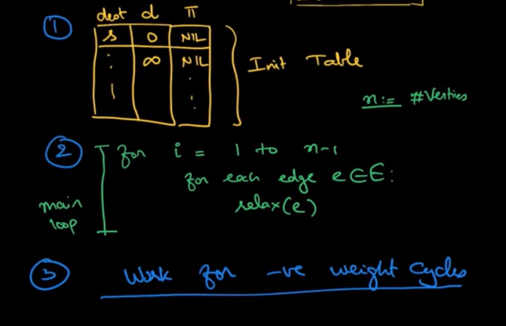

# Idea
Repeating the **Relax** operation to update the shortest path table
Table has 3 properties: DESTINATION, COST ESTIMATED and PI (Parent)



```
if (d[u] + w(u, v)) < d[v] => update d[v]
```



# Bellman-Ford Algorithm
- Init path table
- for i = 1 to n-1
  - for each edge e of E
    - relax(e)
- work for negative edge cycle

