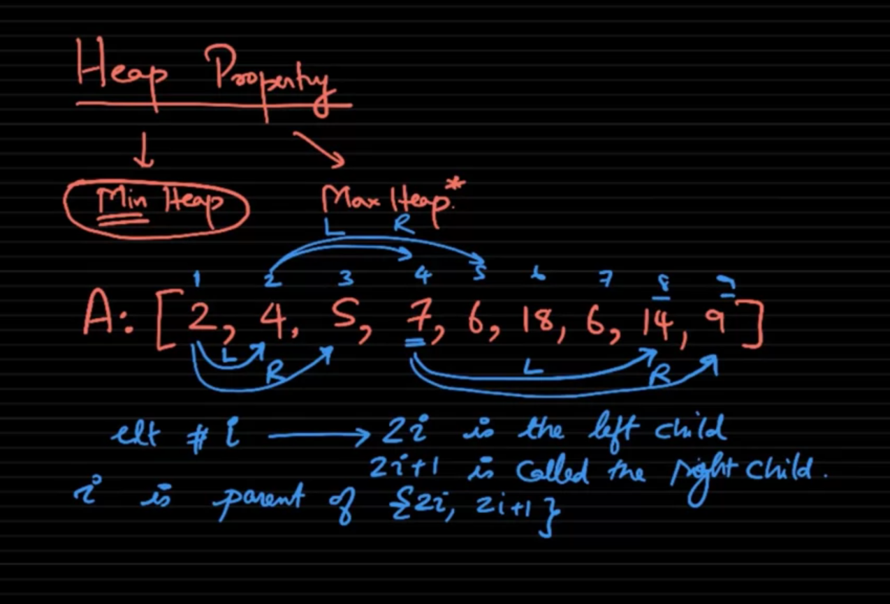
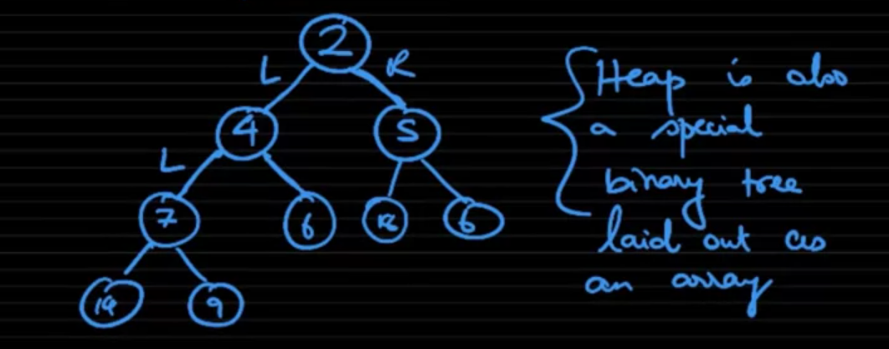
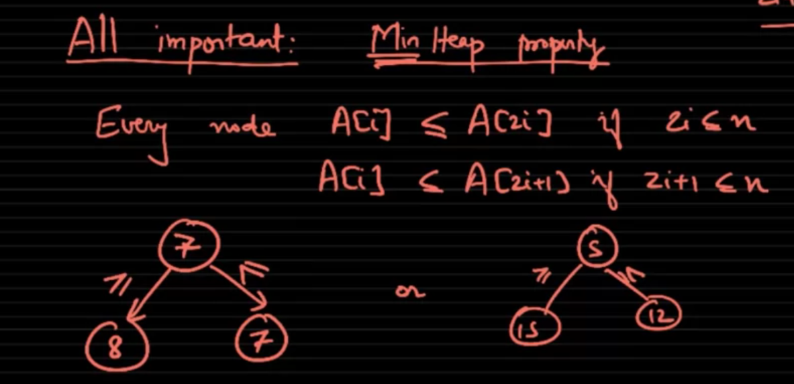

# Heap is just an Array
Heap is just an array with some special properties. Each element in that array called a "key"

# Heap property

Consider element i

2i -> left child
2i + 1 -> right child

### Heap can be visualized by a binary tree

# Max-heap and Min-heap

Max-heap: values of children smaller than parent
Min-heap: parent smaller than children

