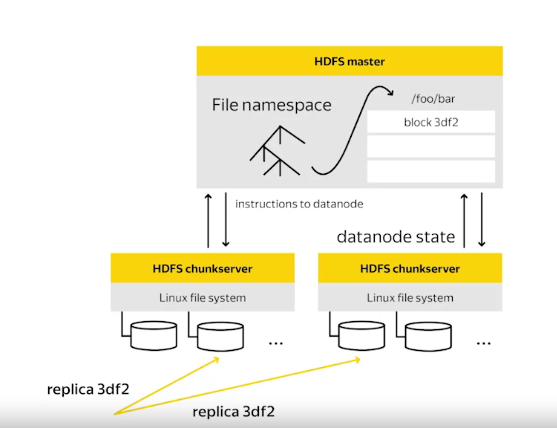

# Block and Replica
**Replica** is a physical data storage on a data node. There are usually several replicas with the same content on different data nodes. 

**Block** is a meta-information storage on a name node
and provides information about replica's locations and their states.

Both replica and block have their own states.

Each block of data has a version number called Generation Stamp (GS). For finalized replicas, all of them have the same GS number which can only increase over time. 

# Replica States
## 1, Replica Being Written to - RBW
It is the state of the last block of a file which was reopened for appending. Data node on disk data and name node meta-information may not match during this state. In case of any failure data node will try to preserve as many bytes as possible (Data Durability).

## 2, Replica Waiting to be Recovered - RWR 
It is a state of all Being Written replicas after data node failure and recovery. RWR replicas will not be in any data node pipeline and therefore will not receive any new data packets. So they either become outdated and should be discarded, or they will participate in a special recovery process called a lease recovery if the client also dies. 

## 3, Replica Under Recovery - RUR
HDFS clients request a lease from name node to have access to write data into a file. In case of this lease expiration, Replica transition to RUR state

## 4, Temporary
When data grow, more nodes are added or removed, data is unevenly distributed. Administrator can call a process of data re-balancing. More replicas will be created and in the state called temporary. It much the same is RBW

# Block State
Block state is stored in memory, not persist in disk (unlike replica)
- User open file for writing -> name node create new block with **under_construction** state
- Client request is done successfully -> block go to **committed** state. 
- Committed blocks keep track of RBW replicas. Until all of them transitioned to **finalized** state -> block go to **final** state