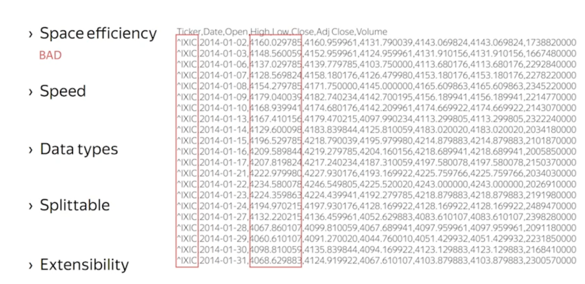
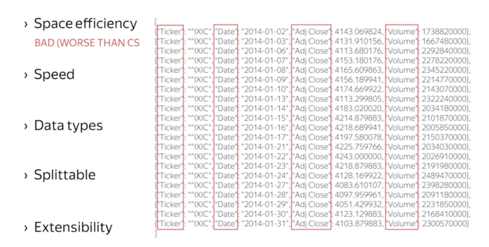

# The main advantage of Text Format is human-readable
- CSV - COMMA-SEPARATED VALUES
- TSV - TAB-SEPARATED VALUES
- JSON - JAVASCRIPT OBJECT NOTATION
- XML

# CSV and TSV
### Space efficiency
Space efficiency in CSV and TSV is bad, because of duplicated value can appear in each line

### Speed
CSV and TSC are simple formats, so their generation and parsing are very efficient.

### Data type
Support only string, which is a big disadvantage

### Splittable
Splittable because of the delimiter, but notice not to include headers

### Extensibility
Really bad

# JSON and XML
### Space efficiency
Even worse than CSV, because of require more space for keys

### Speed
Good enough

### Data type
Support most data type in frequently used programing languages

### Splittable
Splittable if 1 document per line

### Extensibility
This is where JSON shines, add or remove fields in JSON is very easy, but it require more code to check if that value exist

