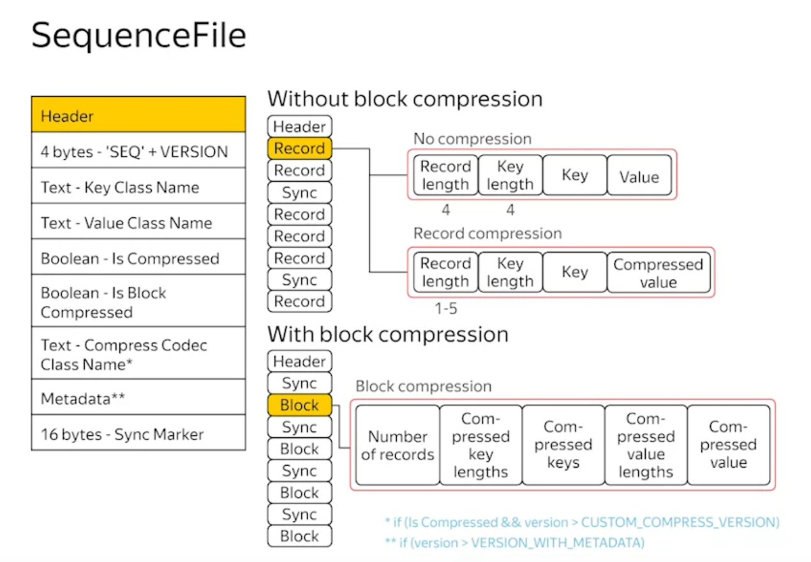
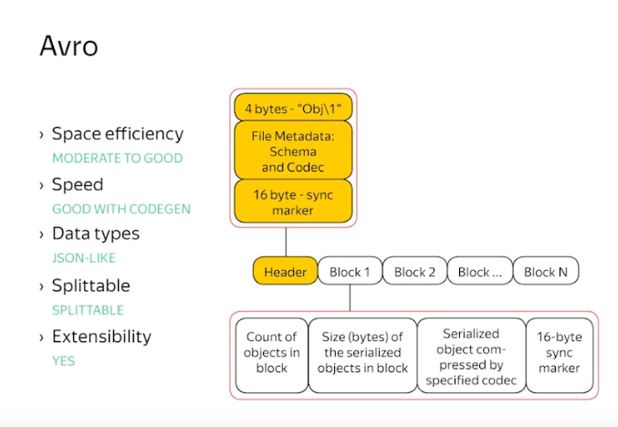

### Speed is not much good in Text Format, Binary Formats are design for faster speed and accuracy

# SequenceFile
SequenceFile is something similar to a Request sent to web server

## Space efficiency
Moderate to good, just need some more space for markers, headers

## Speed
Good, just read through the file, no more conversion

## Data type
Good

## Splittable
Use sync marker to split the file

## Extensibility
No

# Avro File
Like sequence file but has good extensibility. Avro file is block-based format

