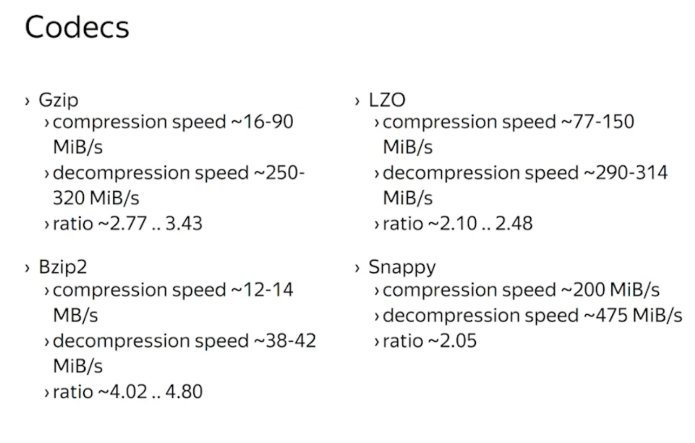
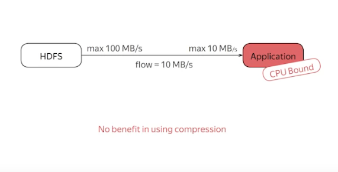
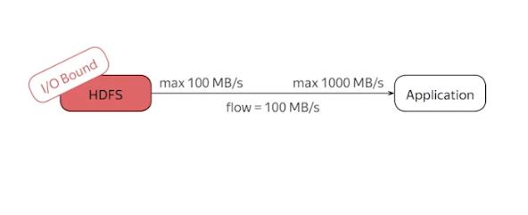
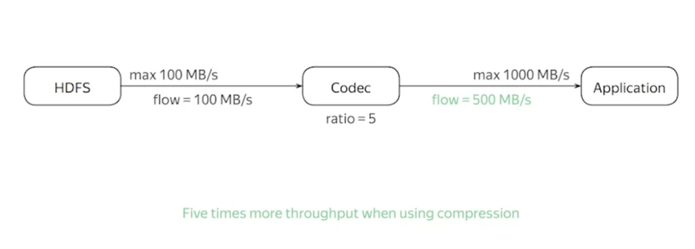

# Kind of compression
- Block-level compression
- File-level compression

# Some compression codecs used in Hadoop world

# Compression in pipeline

### Compression can solve the problem of I/O Bound, which is to balance the computational ability of two application

