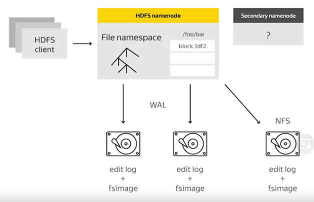

- NameNode store metadata in RAM, different from DataNode storing on disk => Better processing

- NameNode store meta information about other DataNodes. So no matter what is the number of DataNode, each of them cost the same amount of memory on NameNode to store Metadata.

- We use a secondary NameNode in case of failure. Secondary NameNode is a Checkpoint NameNode, not equal BackupNode. Its only store NameNode data in some specific points to reboot NameNode later.