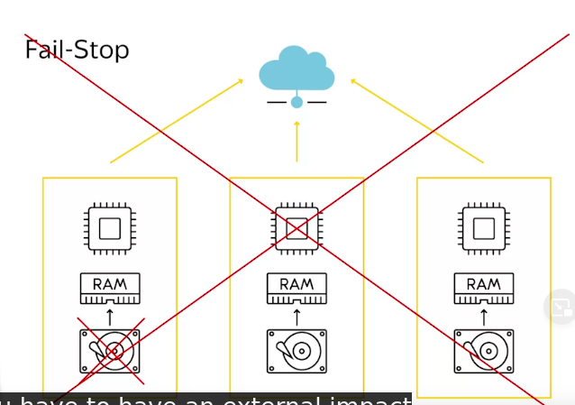
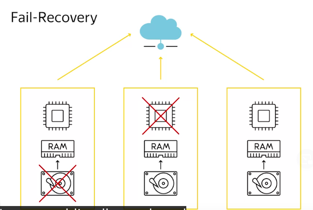
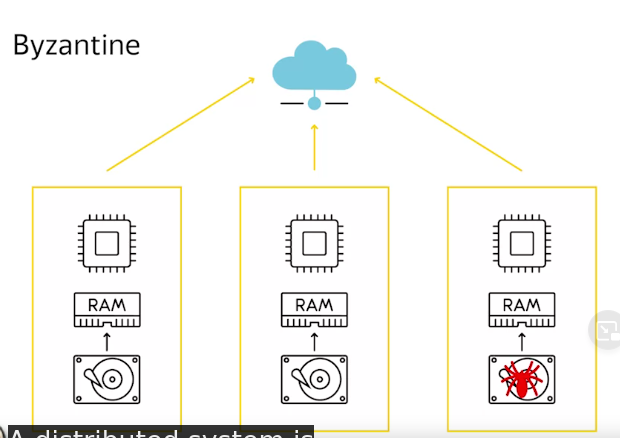
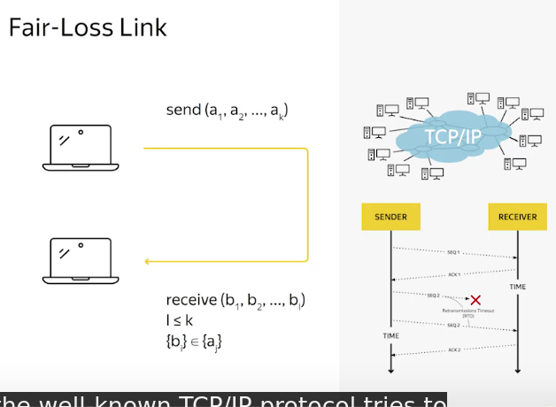
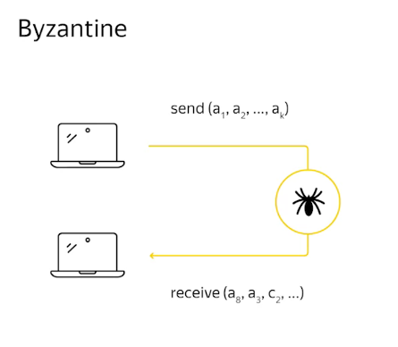
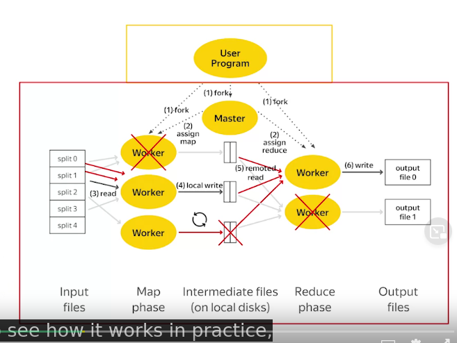

# Node failures
- Fail-stop: a server get out of service and need external impact to bring system back to working state

- Fail-recovery: for some reasons, a node can not complete its computations. This might not have impact on correctness and success of computations. For instance, if a hard drive is damaged, just bring on another hard drive and no other step needed
 

- Byzantine: the computations result is different from expected

# Link failures
- Perfect Link: all send and received data is perfect

- Fair-loss Link: data transferred is missing for some reason
  

- Byzantine

# Fault Tolerance

### When error happen with a mapper or reducer, that mapper or reducer can be reassigned for another worker without stop the job entirely due to the benefit of Functional Programming

