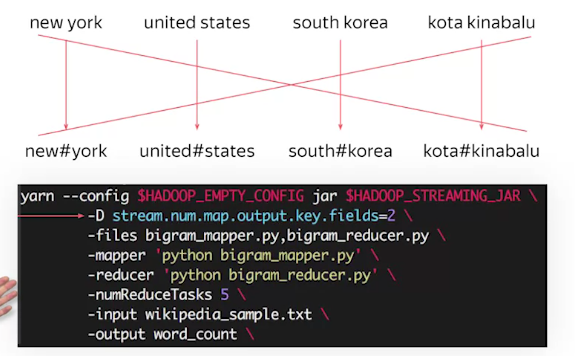
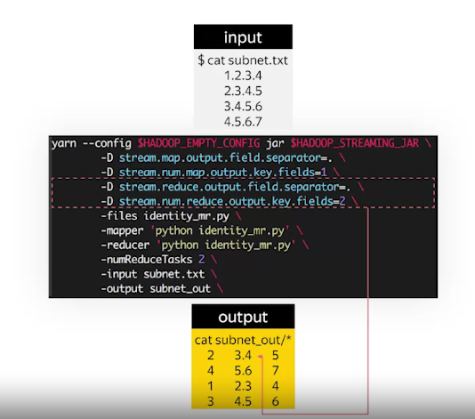

When deal with problem need to calculate word count for collocations, we can partition our input to reduce amount of code

**We can only use partitioner class written in Java. But use only built-in classes is enough for big applications**