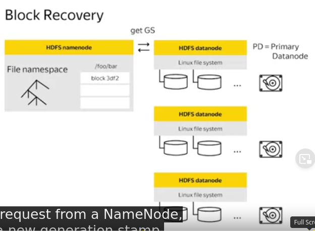
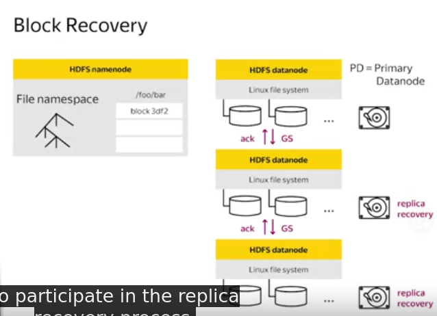
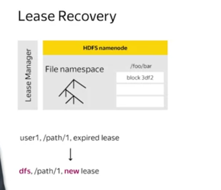
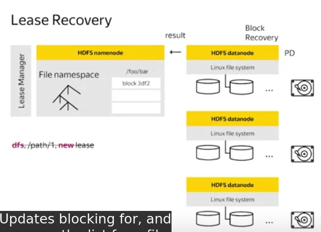

# 1, Block Recovery
During Block recovery, all replicas of a block will transition to the **same state**. By physically, all replicas should have the same disk content.
A Primary DataNode will be choosen and request new GS from NameNode

And let other DataNode know about that GS

# 2, Lease Recovery
Block recovery is a part of Lease recovery. There are Soft and Hard limit. If a lease holder let the Soft limit time out, another client will be able to take over this lease.
When reaching the hard limit, Lease Recovery begin

# 3, Pipeline Recovery
- Setup pipeline, when all DataNode acknowledge, start Streaming
- Each Block is constructed through a pipeline. Block is break down into Packets. Packets are send to DataNode through Pipeline. Streaming is Synchronous
- When success, close pipeline. When failure, request a new GS from NameNode and find a good DataNode and resend data
