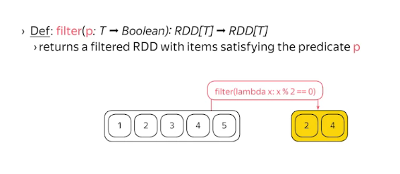
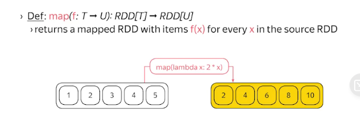
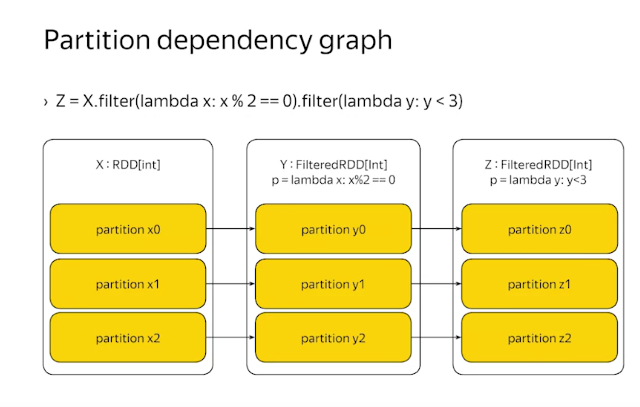
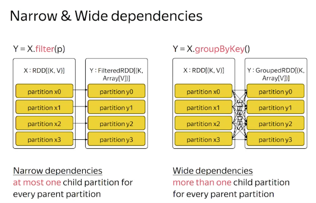

# Transformation allow to create new RDDs from the existing RDDs
The transformed RDD depends on the source RDD to be useful

# Some transformation

# A transformation must have characteristic of an RDD
- Partition
- Iterable
- Dependencies

**All transformation is LAZY**, they compute the result only when accessed

# Dependency graph

# Narrow and Wide dependencies

