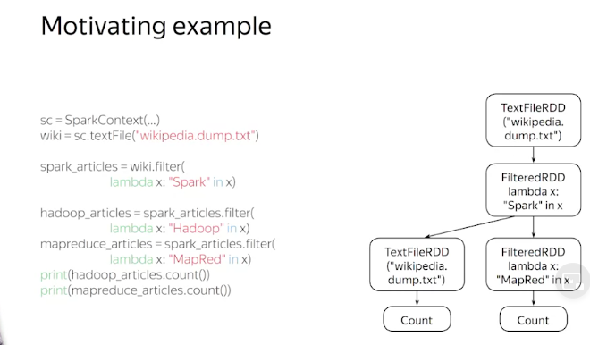
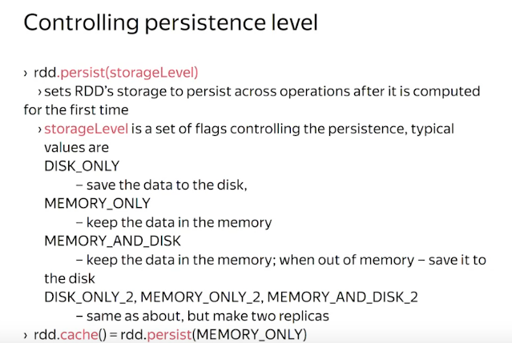

# Problem

Spark dispose intermediate RDD, so those calculation above may perform worse because of reloading wiki dump two more

# Use cache to solve problem    

Intermediate operations can be cached to share 

