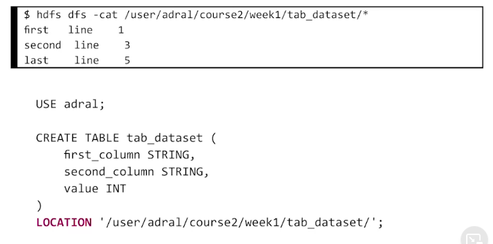
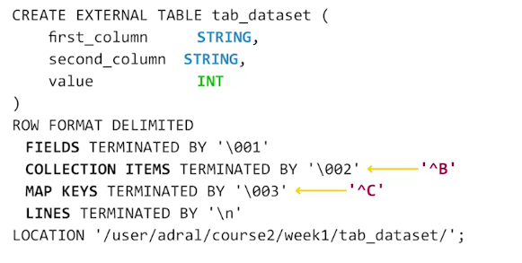

# Create table

# Delimiter
By default HIVE use Control-A as a delimiter

**Table in HIVE can be MANAGED or EXTERNAL**. If table is managed by HIVE, when you delete MANAGED table, all of its data will be deleted as well. But in case of EXTERNAL table, only the METADATA will be deleted