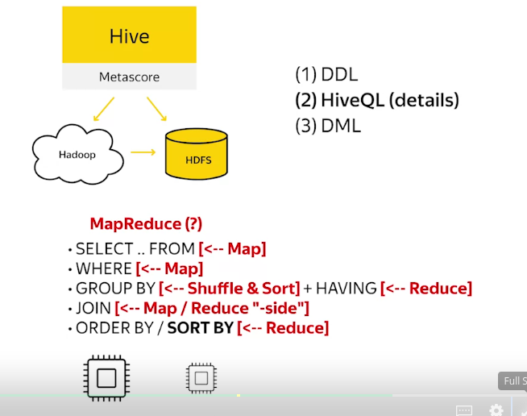
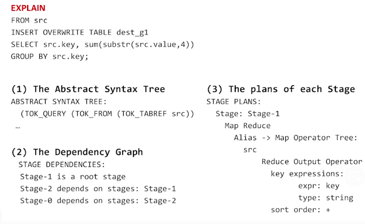

# Import
```
LOAD DATA INPATH '/local/path/data'
INTO TABLE table_data;

INSERT OVERWRITE [LOCAL] DIRECTORY '/tmp/employees'
SELECT name, salary, address
FROM employees
WHERE ...;

```

**Schema On Read**: Hive is not responsible for validating the data to fit into the schema. It will throw exception if data is not aligned with table schema

### By default, new data will be added in to existing file. If there are files with the same name, they will be overwritten

# DDL
```
CREATE TABLE ca_employees
AS 
SELECT name, salary, address
FROM employees
WHERE state = 'CA'
```

# From SQL to Map Reduce


**Be careful to use ORDER BY because it apply sorting on the whole dataset, use SORT BY instead to sort on a particular worker**

# EXPLAIN
