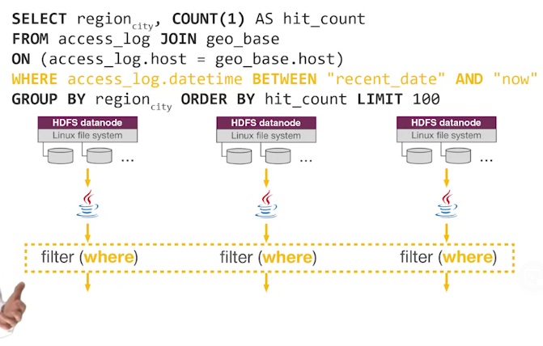
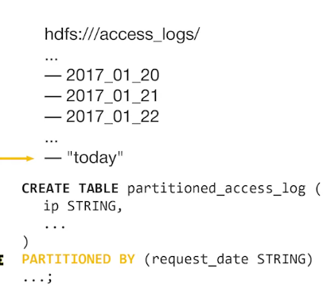
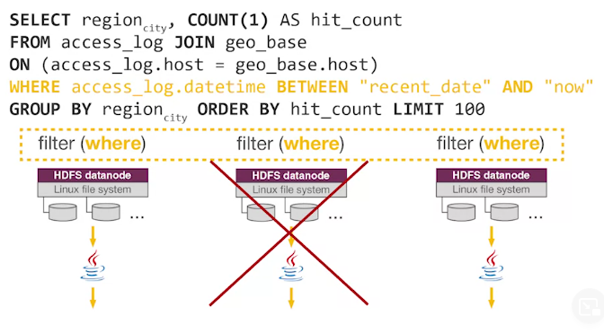
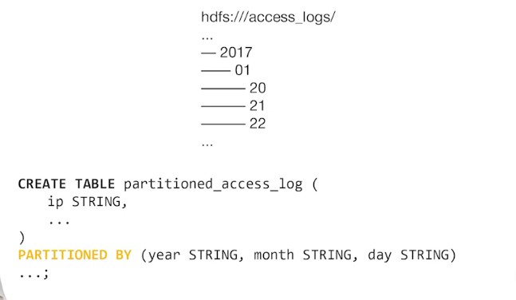
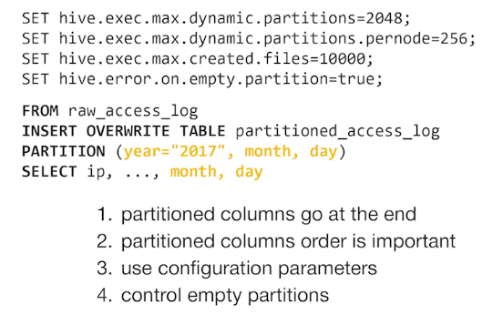
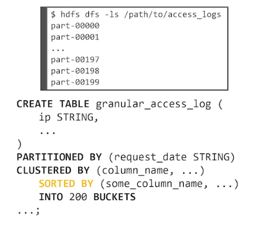
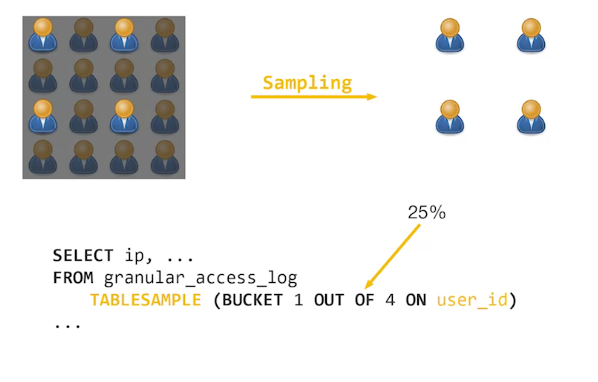

# Partitioning

When using WHERE clause to filter data, we should partition the dataset to remove redundant filter by partitioning dataset to some group with the same properties to filter more easily.

```
CREATE TABLE ...
PARTITION BY (...)
```







### After partitioning, the framework will automatically determine to read that folder or skip



### Dynamic Partitioning



# Bucketing

Bucketing is divided original dataset into groups of many much smaller datasets



# Sampling

